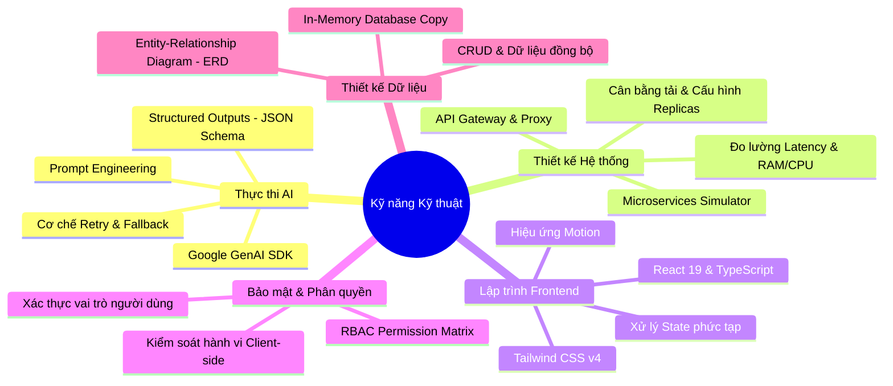

# BÁO CÁO NĂNG LỰC CÔNG NGHỆ & KỸ NĂNG LẬP TRÌNH (SKILL.md)

Tài liệu này tổng hợp toàn bộ các kỹ năng chuyên môn, tư duy thiết kế hệ thống và công nghệ lập trình được áp dụng và minh họa trong dự án **Hệ thống Quản lý & Tạo sinh Đề thi THPT**. Đây là cẩm nang chứng minh năng lực kỹ thuật cần thiết đối với một Kỹ sư phần mềm (Software Engineer) / Lập trình viên Fullstack.

---

## 🎯 Bản Đồ Kỹ Năng Hệ Thống (Skills Map)

---

## 1. Kỹ Năng Kỹ Nghệ Trí Tuệ Nhân Tạo (AI Engineering)

Kỹ năng cốt lõi thể hiện khả năng tích hợp các mô hình ngôn ngữ lớn (LLM) vào luồng nghiệp vụ thực tế của phần mềm:

* **Tích hợp SDK AI tiên tiến:** Sử dụng bộ thư viện chính thức mới nhất của Google (`@google/genai`) để giao tiếp trực tiếp với các mô hình Gemini.
* **Tạo cấu trúc đầu ra chuẩn xác (Structured Outputs):** Thiết lập cấu hình `responseSchema` sử dụng đối tượng `Type` từ SDK nhằm bắt buộc Gemini trả về dữ liệu định dạng JSON chính xác theo cấu trúc định nghĩa trước (gồm danh sách câu hỏi, phương án trả lời độc lập, đáp án đúng dạng chữ cái, phân loại độ khó, giải thích chi tiết).
* **Thiết kế cơ chế tự phục hồi lỗi AI (Fault Tolerance & High Availability):**
  * Xây dựng giải thuật gửi lại yêu cầu tự động (Retry up to 3 times) với khoảng trễ tăng dần (Exponential backoff) khi gặp lỗi quá tải tần suất (Rate Limit 429) hoặc nghẽn mạng (503).
  * Thiết kế luồng hạ cấp mô hình thông minh (Model Fallback): Tự động chuyển đổi từ `gemini-3.5-flash` sang mô hình dự phòng `gemini-3.1-flash-lite` để đảm bảo hệ thống không bị gián đoạn.
* **Kỹ nghệ câu lệnh (Prompt Engineering):** Thiết lập `systemInstruction` định hình vai trò chuyên gia biên soạn đề thi của Bộ Giáo dục cho AI, giúp kiểm soát văn phong, chuẩn hóa thuật ngữ tiếng Việt và nâng cao chất lượng câu hỏi lý thuyết.

---

## 2. Kỹ Năng Thiết Kế Hệ Thống & Microservices (System Architecture)

Thể hiện tư duy thiết kế hệ thống lớn, quản lý luồng dữ liệu và điều phối tài nguyên:

* **Xây dựng API Gateway trung tâm:** Sử dụng Express.js làm cổng điều hướng duy nhất. Gateway chịu trách nhiệm tiếp nhận, ghi nhật ký hoạt động (Activity Logging), lọc tham số và phân luồng định tuyến (Proxy Routing) đến các dịch vụ con.
* **Tư duy Kiến trúc Microservices:** Chia nhỏ hệ thống thành 4 dịch vụ độc lập thực thi nhiệm vụ chuyên biệt:
  * *Gateway Service* (Điều phối, phục vụ client).
  * *Exam Service* (Xử lý nghiệp vụ lưu trữ đề).
  * *AI Service* (Xử lý tác vụ nặng liên quan đến AI).
  * *Analytics Service* (Tính toán thống kê, phổ điểm).
* **Mô phỏng cơ chế Cân bằng tải & Scale:** Thiết kế tính năng tăng/giảm số lượng phiên bản (Replicas) trực tiếp từ giao diện Web. Hệ thống tự động tính toán CPU/RAM tiêu hao tương ứng và giả lập latency thay đổi dựa trên tải trọng số luồng xử lý.

---

## 3. Kỹ Năng Phát Triển Frontend Hiện Đại (Frontend Development)

Thể hiện khả năng xây dựng giao diện chất lượng cao, tối ưu trải nghiệm người dùng (UX):

* **Sử dụng React 19 & TypeScript nghiêm ngặt:** Khai báo kiểu dữ liệu (Types & Interfaces) đầy đủ cho Đề thi, Câu hỏi, Nhật ký log và Cấu hình dịch vụ. Tránh sử dụng kiểu `any` để nâng cao khả năng bảo trì mã nguồn.
* **Styling bằng Tailwind CSS v4:** Sử dụng hệ màu hiện đại, tạo chiều sâu cho giao diện bằng shadow và các đường viền mờ (glassmorphism), hỗ trợ responsive hoàn chỉnh cho thiết bị di động.
* **Xử lý trạng thái (State Management) phức tạp:**
  * Quản lý trạng thái đa bước trong hộp thoại thiết kế đề thi (Wizard).
  * Quản lý trạng thái tương tác ngân hàng câu hỏi (chọn đáp án, trả về phản hồi tức thì, lưu kết quả làm bài tạm thời).
* **Giao diện động phản hồi nhanh:** Tạo hiệu ứng hover tinh tế, các thanh tiến trình trực quan hóa chỉ số CPU/RAM và các hiệu ứng chuyển tab mượt mà.

---

## 4. Kỹ Năng Bảo Mật & Phân Quyền (Security & Access Control)

Thể hiện hiểu biết về an toàn thông tin và phân định quyền hạn trong phần mềm:

* **Mô phỏng Phân quyền dựa trên vai trò (RBAC):** Xây dựng ma trận phân quyền chi tiết cho 3 đối tượng người dùng:
  * **Học sinh (Student):** Chỉ được phép xem danh sách đề, thực hiện làm bài kiểm tra thử, xem điểm và thống kê cá nhân. Các nút hành động quản trị bị khóa hoặc ẩn.
  * **Giáo viên (Teacher):** Có quyền xem đề, soạn thảo đề thi bằng AI, quản lý ngân hàng câu hỏi. Không được phép can thiệp vào hệ thống Microservices của hệ thống.
  * **Quản trị viên (Admin):** Toàn quyền kiểm soát hệ thống, bao gồm cấu hình scale microservices, xem log hệ thống và thiết lập hệ thống.
* **Kiểm soát hành vi ở Client-side:** Tự động điều chỉnh giao diện hiển thị, ẩn các tính năng nhạy cảm dựa trên vai trò đang chọn để tăng cường tính bảo mật UI.

---

## 5. Kỹ Năng Thiết Kế Cơ Sở Dữ Liệu (Database Design)

Thể hiện năng lực tổ chức và mô hình hóa dữ liệu nghiệp vụ:

* **Mô hình hóa thực thể (ERD):** Thiết kế cấu trúc bảng dữ liệu logic được tài liệu hóa rõ ràng trong mã nguồn bao gồm mối quan hệ 1-N giữa Đề thi (`Exam`) và Câu hỏi (`Question`).
* **Lập trình cơ sở dữ liệu In-Memory:** Mô phỏng các câu lệnh SQL thông qua các mảng dữ liệu được kiểm soát chặt chẽ trên bộ nhớ RAM ở phía Backend, giúp tối ưu hóa tốc độ phản hồi và đơn giản hóa môi trường triển khai thử nghiệm.
