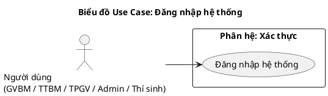
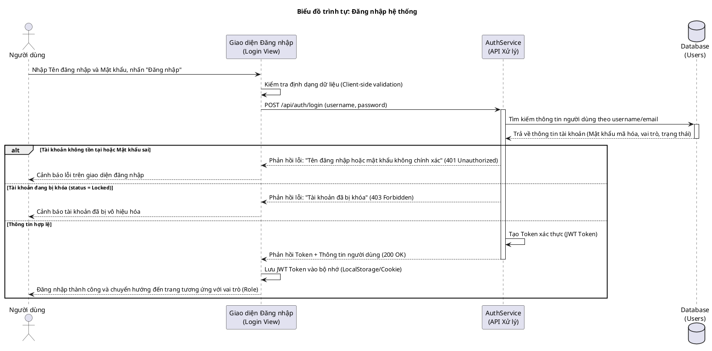
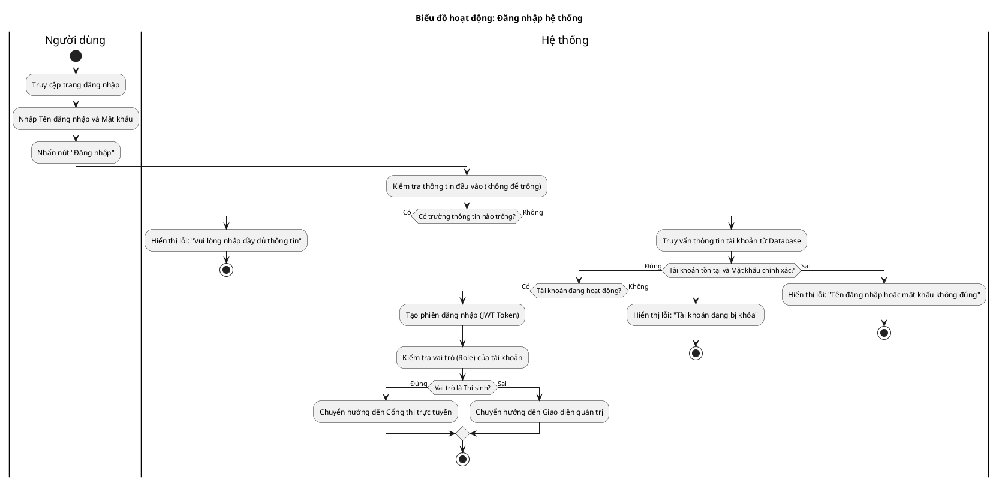

# Tài liệu Đặc tả: Chức năng Đăng nhập (Authentication)

## 1. Bảng Use Case chức năng

*Bảng 2.10. Bảng usecase chức năng đăng nhập*

| Tên Use case           | Tác nhân                    | Giao dịch                                                                                                              | Độ phức tạp |
| :---------------------- | :---------------------------- | :---------------------------------------------------------------------------------------------------------------------- | :-------------- |
| **Đăng nhập**           | **Mọi người dùng (GVBM, TTBM, TPGV, Admin, Thí sinh)** |                                                                                                                         | Dễ             |
|                         |                               | Người dùng nhập thông tin Tên đăng nhập và Mật khẩu để xác thực tài khoản. Hệ thống kiểm tra thông tin đăng nhập.        |                 |
|                         |                               | Hệ thống kiểm tra trạng thái tài khoản. Nếu tài khoản bị khóa, hệ thống hiển thị thông báo lỗi.                          |                 |
|                         |                               | Hệ thống phân loại vai trò (Role) của người dùng để chuyển hướng đến giao diện tương ứng (Dashboard quản trị hoặc Cổng thi). |                 |

---

## 2. Biểu đồ Use Case (Use Case Diagram)

**Mô tả:** Biểu đồ mô tả tương tác đăng nhập của mọi vai trò người dùng trong hệ thống (Giáo viên bộ môn, Tổ trưởng bộ môn, Trưởng phòng giáo vụ, Quản trị viên, Thí sinh). Người dùng thực hiện đăng nhập và hệ thống cung cấp tính năng mở rộng là Lấy lại mật khẩu khi quên.

**Mục tiêu:** Thể hiện cổng đăng nhập thống nhất, đảm bảo tính an toàn dữ liệu và cơ chế chuyển hướng người dùng theo phân quyền.

---

## 3. Biểu đồ Trình tự chức năng (Sequence Diagram)

**Mô tả:** Quy trình tương tác diễn giải các bước từ khi người dùng điền thông tin biểu mẫu đăng nhập, hệ thống tiến hành kiểm tra thông tin dưới Database, mã hóa xác thực, sinh mã Token JWT và phản hồi trạng thái đăng nhập thành công hay thất bại.

---

## 4. Biểu đồ Hoạt động (Activity Diagram)

**Mô tả:** Biểu đồ hoạt động mô tả tiến trình đăng nhập của người dùng qua các bộ lọc xác thực (điền đầy đủ thông tin, kiểm tra tính đúng đắn tài khoản, kiểm tra trạng thái tài khoản) và điều phối về giao diện làm việc phù hợp với vai trò của mình.

