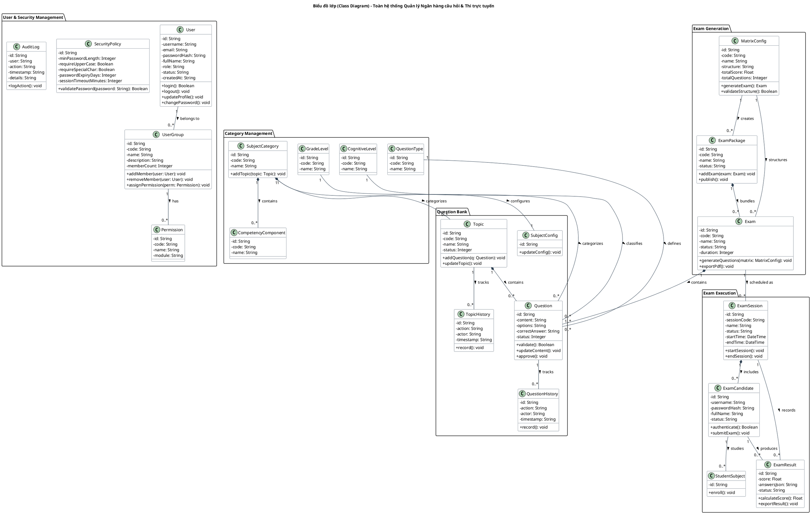
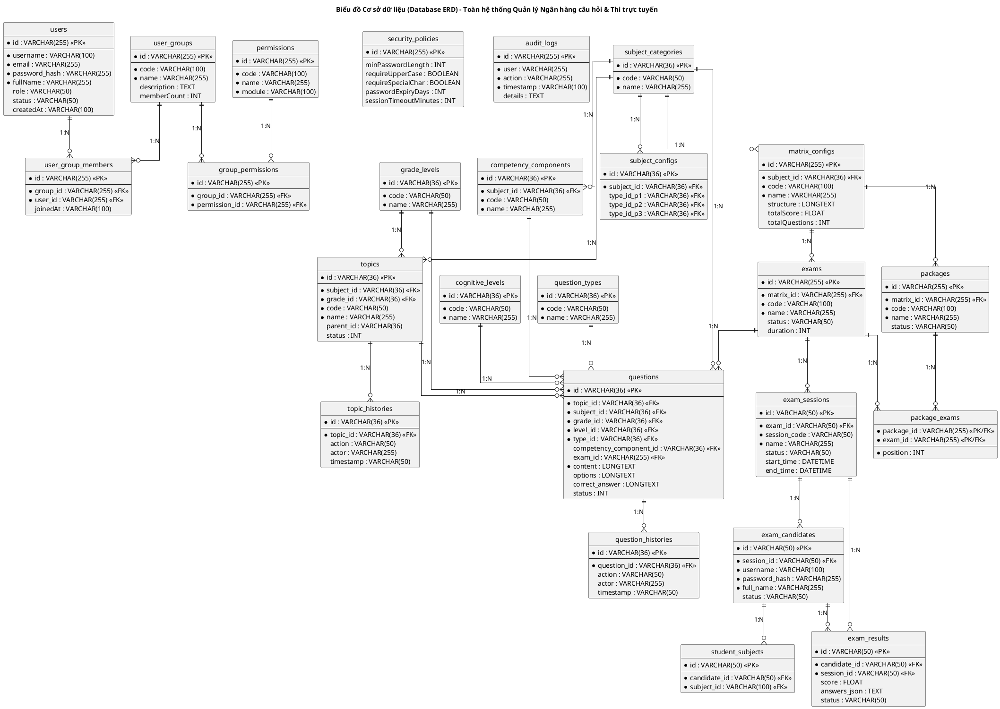

# Phân tích thiết kế: Kiến trúc Lớp (Class & Database Diagram) Toàn Hệ Thống

Tài liệu này cung cấp cái nhìn tổng quan về cấu trúc tĩnh của hệ thống **Quản lý thi trắc nghiệm AI**, bao gồm cả khía cạnh thiết kế phần mềm (Mô hình hướng đối tượng) và khía cạnh thiết kế dữ liệu (Mô hình thực thể - CSDL).

---

## 1. Biểu đồ Lớp Phần mềm (Software Class Diagram)

Biểu đồ này mô tả các lớp đối tượng chính, thuộc tính, phương thức cơ bản và mối quan hệ giữa chúng trong mã nguồn ứng dụng (Backend/Frontend).

### Mô tả và Mục tiêu

* **Mô tả:** Các lớp (Class) được phân chia thành 4 cụm logic (User Management, Question Bank, Exam Generation, Exam Execution) với các quan hệ kế thừa và kết hợp rõ ràng.
* **Mục tiêu:** Cung cấp tài liệu thiết kế phần mềm ở mức chi tiết (Detailed Design). Giúp Developer hiểu được kiến trúc đối tượng trong Code và triển khai các API một cách chặt chẽ.

---

## 2. Biểu đồ Lớp Cơ sở dữ liệu (Database ERD)

Biểu đồ này là mô hình Thực thể - Mối quan hệ (ERD), mô tả chi tiết toàn bộ các bảng vật lý (25 bảng) hiện có trong Hệ quản trị CSDL của hệ thống bao gồm 2 phân hệ: Quản lý ngân hàng câu hỏi đề thi và Hệ thống thi trực tuyến.

### Mô tả và Mục tiêu

* **Mô tả:** Biểu đồ mô hình dữ liệu (ERD) được kết xuất trực tiếp từ hệ thống CSDL vật lý của dự án bao gồm 25 bảng thực thể. Hệ thống chia thành 5 phân nhóm chính: **User & Security Management**, **Category Management**, **Question Bank**, **Exam Generation** và **Exam Execution**. Các mối quan hệ (Foreign Keys) được thiết lập đầy đủ nhằm đảm bảo tính toàn vẹn dữ liệu.
* **Mục tiêu:** Là bản thiết kế nền tảng cho việc khởi tạo CSDL vật lý (Database Schema). Giúp các lập trình viên xây dựng các Models/Entities, thiết lập quan hệ (ORM Relationships) và viết câu lệnh SQL chuẩn xác, đảm bảo tính nhất quán và toàn vẹn dữ liệu cho toàn bộ dự án.
