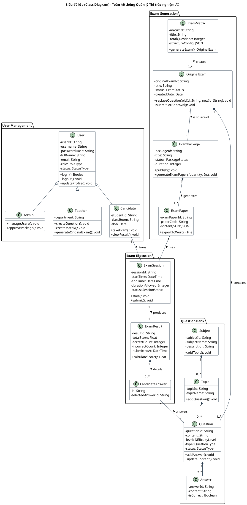

# Phân tích thiết kế: Kiến trúc Lớp (Class & Database Diagram) Toàn Hệ Thống

Tài liệu này cung cấp cái nhìn tổng quan về cấu trúc tĩnh của hệ thống **Quản lý thi trắc nghiệm AI**, bao gồm cả khía cạnh thiết kế phần mềm (Mô hình hướng đối tượng) và khía cạnh thiết kế dữ liệu (Mô hình thực thể - CSDL).

---

## 1. Biểu đồ Lớp Phần mềm (Software Class Diagram)

Biểu đồ này mô tả các lớp đối tượng chính, thuộc tính, phương thức cơ bản và mối quan hệ giữa chúng trong mã nguồn ứng dụng (Backend/Frontend).

### Mô tả và Mục tiêu

* **Mô tả:** Các lớp (Class) được phân chia thành 4 cụm logic (User Management, Question Bank, Exam Generation, Exam Execution) với các quan hệ kế thừa và kết hợp rõ ràng.
* **Mục tiêu:** Cung cấp tài liệu thiết kế phần mềm ở mức chi tiết (Detailed Design). Giúp Developer hiểu được kiến trúc đối tượng trong Code và triển khai các API một cách chặt chẽ.

---

## 2. Biểu đồ Lớp Cơ sở dữ liệu (Database ERD)

Biểu đồ này là mô hình Thực thể - Mối quan hệ (ERD), mô tả cách tổ chức dữ liệu vật lý trong Hệ quản trị cơ sở dữ liệu (MySQL / PostgreSQL...).

```plantuml
@startuml
title Biểu đồ Cơ sở dữ liệu (Database ERD) - Toàn hệ thống Quản lý Thi trắc nghiệm AI

' Style settings
hide circle
skinparam linetype ortho
skinparam shadowing false
skinparam entity {
    BackgroundColor White
    BorderColor #2C3E50
    ArrowColor #2C3E50
}

' ================= User Management =================
entity "users" as users {
  * id : INT <<PK>>
  --
  * username : VARCHAR(50)
  * password : VARCHAR(255)
  * full_name : VARCHAR(100)
  email : VARCHAR(100)
  * role : ENUM('ADMIN', 'TEACHER', 'CANDIDATE')
  * status : ENUM('ACTIVE', 'INACTIVE')
  created_at : DATETIME
  updated_at : DATETIME
}

entity "candidates" as candidates {
  * id : INT <<PK>>
  --
  * user_id : INT <<FK>>
  * student_code : VARCHAR(20)
  class_name : VARCHAR(50)
  dob : DATE
}

' ================= Question Bank =================
entity "subjects" as subjects {
  * id : INT <<PK>>
  --
  * code : VARCHAR(20)
  * name : VARCHAR(100)
  description : TEXT
}

entity "topics" as topics {
  * id : INT <<PK>>
  --
  * subject_id : INT <<FK>>
  * name : VARCHAR(255)
  description : TEXT
}

entity "questions" as questions {
  * id : INT <<PK>>
  --
  * topic_id : INT <<FK>>
  * content : TEXT
  * difficulty_level : ENUM('EASY', 'MEDIUM', 'HARD')
  * question_type : ENUM('SINGLE', 'MULTIPLE')
  * status : ENUM('ACTIVE', 'INACTIVE', 'DRAFT')
  created_at : DATETIME
}

entity "answers" as answers {
  * id : INT <<PK>>
  --
  * question_id : INT <<FK>>
  * content : TEXT
  * is_correct : BOOLEAN
}

' ================= Exam Generation =================
entity "exam_matrices" as exam_matrices {
  * id : INT <<PK>>
  --
  * created_by : INT <<FK>>
  * title : VARCHAR(255)
  * total_questions : INT
  * duration_minutes : INT
  * structure_config : JSON
  created_at : DATETIME
}

entity "original_exams" as original_exams {
  * id : INT <<PK>>
  --
  * matrix_id : INT <<FK>>
  * created_by : INT <<FK>>
  * title : VARCHAR(255)
  * status : ENUM('DRAFT', 'PENDING', 'APPROVED', 'REJECTED')
  created_at : DATETIME
}

entity "original_exam_questions" as original_exam_questions {
  * original_exam_id : INT <<PK/FK>>
  * question_id : INT <<PK/FK>>
  --
  order_index : INT
}

entity "exam_packages" as exam_packages {
  * id : INT <<PK>>
  --
  * original_exam_id : INT <<FK>>
  * title : VARCHAR(255)
  * status : ENUM('ACTIVE', 'INACTIVE')
  created_at : DATETIME
}

entity "exam_papers" as exam_papers {
  * id : INT <<PK>>
  --
  * package_id : INT <<FK>>
  * paper_code : VARCHAR(20)
  * content_json : JSON
  created_at : DATETIME
}

' ================= Exam Execution & Results =================
entity "exam_sessions" as exam_sessions {
  * id : INT <<PK>>
  --
  * candidate_id : INT <<FK>>
  * paper_id : INT <<FK>>
  start_time : DATETIME
  end_time : DATETIME
  * status : ENUM('IN_PROGRESS', 'SUBMITTED', 'CANCELLED')
}

entity "exam_results" as exam_results {
  * id : INT <<PK>>
  --
  * session_id : INT <<FK>>
  total_score : FLOAT
  correct_answers : INT
  incorrect_answers : INT
  submitted_at : DATETIME
}

entity "candidate_answers" as candidate_answers {
  * id : INT <<PK>>
  --
  * result_id : INT <<FK>>
  * question_id : INT <<FK>>
  selected_answer_id : INT <<FK>>
  is_correct : BOOLEAN
}

' ================= Relationships (Ràng buộc khóa ngoại) =================
users ||--o| candidates : "1:1"
users ||--o{ exam_matrices : "1:N"
users ||--o{ original_exams : "1:N"

subjects ||--o{ topics : "1:N"
topics ||--o{ questions : "1:N"
questions ||--o{ answers : "1:N"

exam_matrices ||--o{ original_exams : "1:N"
original_exams ||--o{ original_exam_questions : "1:N"
questions ||--o{ original_exam_questions : "1:N"

original_exams ||--o| exam_packages : "1:1"
exam_packages ||--o{ exam_papers : "1:N"

candidates ||--o{ exam_sessions : "1:N"
exam_papers ||--o{ exam_sessions : "1:N"

exam_sessions ||--o| exam_results : "1:1"
exam_results ||--o{ candidate_answers : "1:N"
candidate_answers }o--|| questions : "N:1"

@enduml
```

### Mô tả và Mục tiêu

* **Mô tả:** Biểu đồ mô hình dữ liệu (ERD) được thiết kế chi tiết với đầy đủ các bảng (Tables), khóa chính (Primary Key - PK), khóa ngoại (Foreign Key - FK), các trường dữ liệu quan trọng và kiểu dữ liệu tương ứng (VARCHAR, INT, DATETIME, JSON...).
* **Mục tiêu:** Là bản thiết kế nền tảng cho việc khởi tạo CSDL vật lý (Database Schema). Giúp các lập trình viên xây dựng các Models/Entities, thiết lập quan hệ (ORM Relationships) và viết câu lệnh SQL chuẩn xác, đảm bảo tính nhất quán và toàn vẹn dữ liệu cho toàn bộ dự án.
