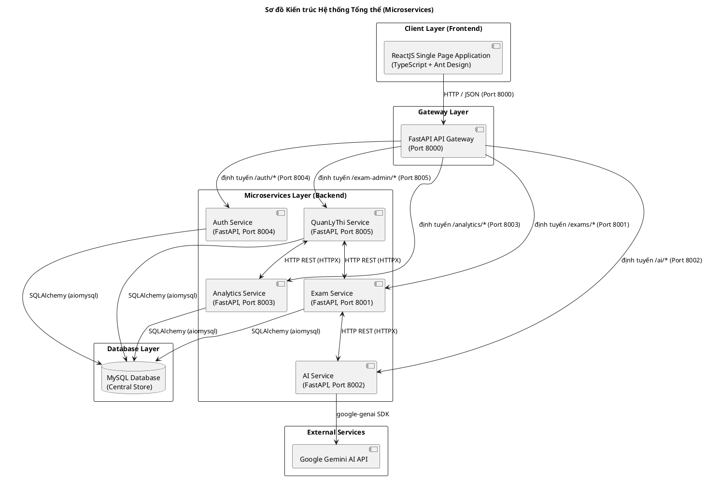

# Tài liệu Thiết kế: Kiến trúc Hệ thống Tổng thể

## 1. Mô tả Kiến trúc Hệ thống

Hệ thống được thiết kế theo mô hình **Microservices** nhằm đảm bảo tính linh hoạt, độc lập khi triển khai và khả năng mở rộng theo chiều ngang (horizontal scaling).

### Các thành phần chính của hệ thống:

1. **Frontend (ReactJS SPA)**:
   - Ứng dụng trang đơn (SPA) được phát triển bằng **ReactJS** kết hợp **TypeScript**.
   - Sử dụng thư viện UI **Ant Design (Antd)** mang lại giao diện trực quan, đồng bộ và tối ưu hóa trải nghiệm người dùng trên các trình duyệt hiện đại (Chrome, Edge, Firefox).

2. **API Gateway (FastAPI, Port 8000)**:
   - Cổng truy cập duy nhất đối với giao diện Frontend.
   - Nhận tất cả các yêu cầu từ Client, thực hiện phân tích URL Path và định tuyến (Reverse Proxy) tới các microservice nội bộ.
   - Xử lý tập trung chính sách CORS và ghi nhật ký truy cập (Traffic logging).

3. **Hệ thống Microservices**:
   - **Auth Service (FastAPI, Port 8004)**: Quản lý xác thực người dùng (Login), cấp phát tài khoản cán bộ/giáo viên (do Admin thực hiện). Lưu trữ nhóm quyền (RBAC), kiểm soát chính sách bảo mật hệ thống (yêu cầu độ phức tạp mật khẩu, timeout phiên) và ghi nhật ký thao tác (Audit Log).
   - **Exam Service (FastAPI, Port 8001)**: Phân hệ nghiệp vụ cốt lõi quản lý đề thi gốc, cấu hình ma trận đề, gói đề thi hoán vị. Quản lý danh mục dùng chung (môn học, khối lớp, cấp độ tư duy, thành phần năng lực, chủ đề câu hỏi) và ngân hàng câu hỏi (CRUD, thẩm định/phê duyệt).
   - **AI Service (FastAPI, Port 8002)**: Tích hợp mô hình ngôn ngữ lớn **Google Gemini AI** (thông qua SDK `google-genai` chính thức) để tự động sinh câu hỏi trắc nghiệm theo ma trận yêu cầu (hỗ trợ cả 3 phần trắc nghiệm theo định dạng mới của Bộ GD&ĐT) và gợi ý thông tin đề thi phù hợp.
   - **Analytics Service (FastAPI, Port 8003)**: Tổng hợp số liệu thống kê phổ điểm, độ khó trung bình của câu hỏi và xuất báo cáo phân tích dữ liệu kiểm tra.
   - **QuanLyThi Service (FastAPI, Port 8005)**: Quản lý tổ chức thi và giám sát phòng thi. Quản lý danh sách thí sinh dự thi, tiến trình làm bài trực tuyến (lưu nháp, nộp bài) và tính điểm tự động.

4. **Cơ chế giao tiếp giữa các Service**:
   - Giao tiếp đồng bộ trực tiếp thông qua giao thức **HTTP REST API** sử dụng thư viện **HTTPX** của Python.
   - Trao đổi dữ liệu theo định dạng chuẩn **JSON**.

5. **Cơ sở dữ liệu (MySQL)**:
   - Sử dụng **MySQL** làm kho lưu trữ dữ liệu trung tâm.
   - Các microservice kết nối đến MySQL thông qua **SQLAlchemy ORM** sử dụng trình điều khiển bất đồng bộ **aiomysql** nhằm tối ưu hóa hiệu năng xử lý đa luồng dữ liệu.

---

## 2. Sơ đồ Kiến trúc Hệ thống (Microservices Architecture Diagram)

**Mô tả:** Sơ đồ Component Diagram mô tả cấu trúc phân lớp từ Client Layer, Gateway Layer, Microservices Layer tới Database Layer và tích hợp dịch vụ bên ngoài (Google Gemini AI).

