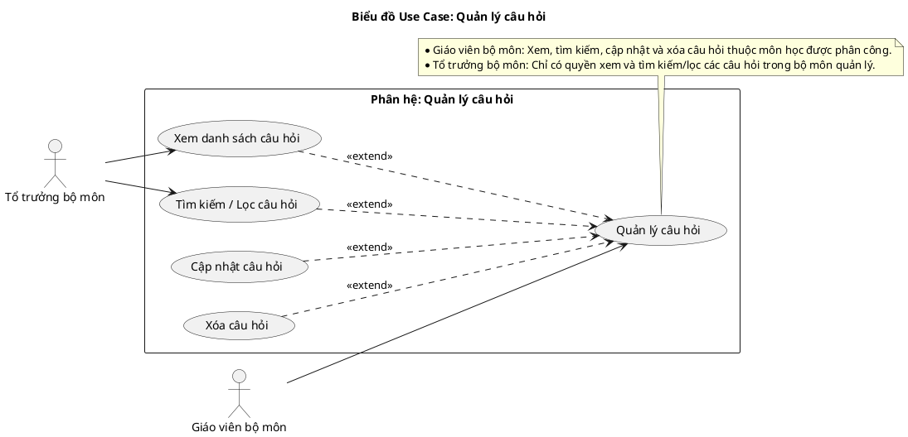
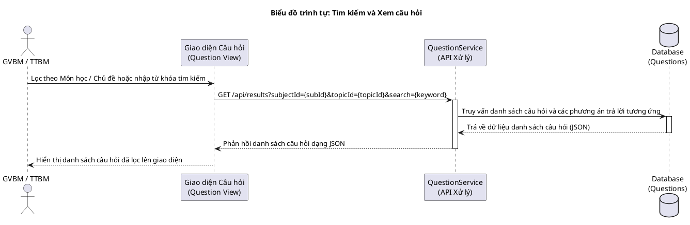
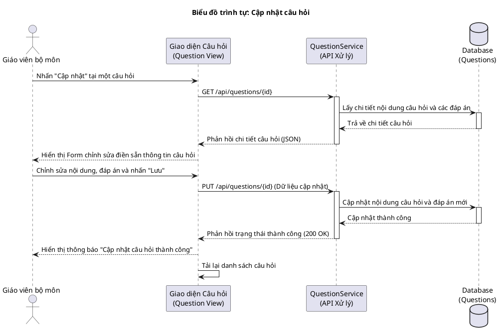
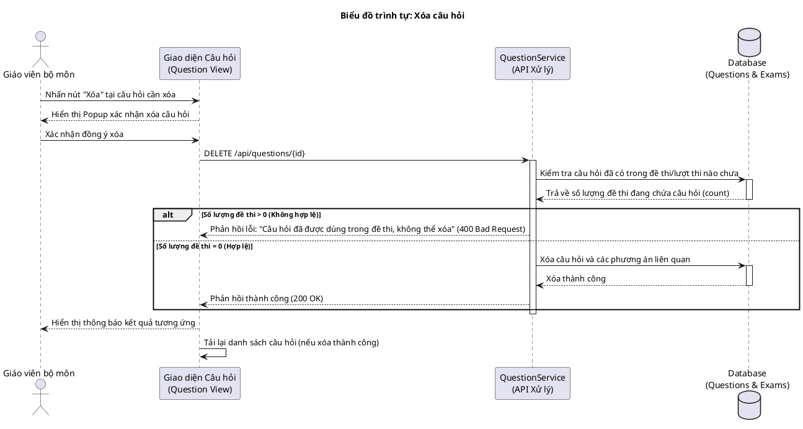
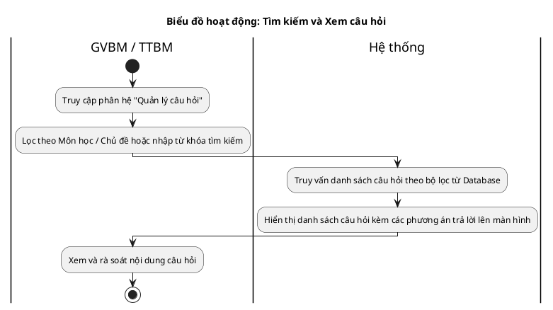
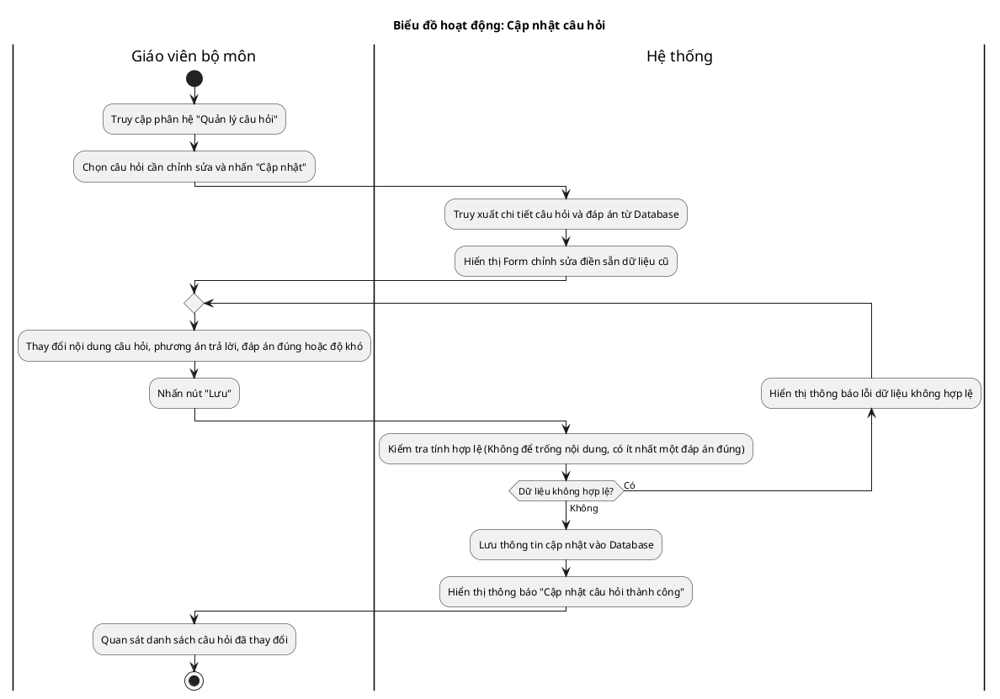
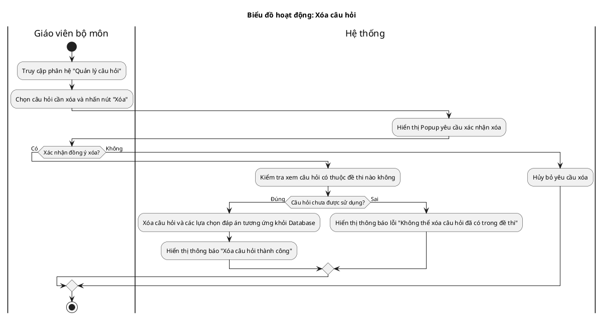

# Tài liệu Đặc tả: Quản lý Ngân hàng Câu hỏi (Question Bank Management)

## 1. Bảng Use Case chức năng

*Bảng 2.8. Bảng usecase chức năng quản lý ngân hàng câu hỏi*

| Tên Use case           | Tác nhân                    | Giao dịch                                                                                                              | Độ phức tạp |
| :---------------------- | :---------------------------- | :---------------------------------------------------------------------------------------------------------------------- | :-------------- |
| **Quản lý câu hỏi**     | **Giáo viên bộ môn (GVBM)**   |                                                                                                                         | Phức tạp        |
|                         |                               | Giáo viên bộ môn xem danh sách các câu hỏi trong ngân hàng câu hỏi. Hệ thống hiển thị danh sách.                        |                 |
|                         |                               | Giáo viên bộ môn tìm kiếm và lọc câu hỏi theo môn học, chủ đề, mức độ nhận thức. Hệ thống hiển thị danh sách khớp.       |                 |
|                         |                               | Giáo viên bộ môn cập nhật nội dung câu hỏi, các phương án lựa chọn và đáp án đúng. Hệ thống lưu lại các thay đổi.       |                 |
|                         |                               | Giáo viên bộ môn thực hiện xóa câu hỏi. Hệ thống xác nhận và xóa khỏi cơ sở dữ liệu nếu câu hỏi chưa nằm trong đề thi. |                 |
|                         | **Tổ trưởng bộ môn (TTBM)**   |                                                                                                                         | Dễ             |
|                         |                               | Tổ trưởng bộ môn xem danh sách các câu hỏi thuộc bộ môn phụ trách. Hệ thống hiển thị danh sách.                         |                 |
|                         |                               | Tổ trưởng bộ môn tìm kiếm và lọc câu hỏi theo môn học, chủ đề, mức độ nhận thức. Hệ thống hiển thị danh sách khớp.       |                 |

---

## 2. Biểu đồ Use Case (Use Case Diagram)

**Mô tả:** Biểu đồ minh họa sự tương tác của Giáo viên bộ môn (GVBM) và Tổ trưởng bộ môn (TTBM) đối với phân hệ quản lý câu hỏi trong ngân hàng câu hỏi. Giáo viên bộ môn được thực hiện toàn bộ các chức năng tra cứu, cập nhật và xóa, trong khi Tổ trưởng bộ môn chỉ có quyền xem và tra cứu/lọc danh sách câu hỏi.

**Mục tiêu:** Thể hiện phân quyền rõ ràng giữa GVBM (người quản lý trực tiếp nội dung câu hỏi) và TTBM (người duyệt, giám sát chất lượng ngân hàng câu hỏi).

---

## 3. Biểu đồ Trình tự chức năng (Sequence Diagram)

### Biểu đồ trình tự 1: Tìm kiếm và Xem câu hỏi

**Mô tả:** Diễn giải quy trình tương tác khi Giáo viên bộ môn hoặc Tổ trưởng bộ môn thực hiện tìm kiếm và lọc danh sách câu hỏi theo các tiêu chí (môn học, chủ đề, từ khóa).

### Biểu đồ trình tự 2: Cập nhật câu hỏi

**Mô tả:** Diễn giải quy trình Giáo viên bộ môn thực hiện chỉnh sửa nội dung câu hỏi, các phương án trả lời và đáp án đúng. Hệ thống hiển thị lại dữ liệu cũ và cập nhật thông tin mới vào cơ sở dữ liệu.

### Biểu đồ trình tự 3: Xóa câu hỏi

**Mô tả:** Quy trình Giáo viên bộ môn yêu cầu xóa câu hỏi. Hệ thống kiểm tra xem câu hỏi có thuộc đề thi nào chưa trước khi tiến hành xóa để tránh phá vỡ tính toàn vẹn dữ liệu.

---

## 4. Biểu đồ Hoạt động (Activity Diagram)

### Biểu đồ hoạt động 1: Tìm kiếm và Xem câu hỏi

**Mô tả:** Luồng hoạt động tìm kiếm và duyệt danh sách các câu hỏi trong ngân hàng.

### Biểu đồ hoạt động 2: Cập nhật câu hỏi

**Mô tả:** Luồng hoạt động chỉnh sửa câu hỏi hiện tại, tích hợp vòng lặp kiểm tra tính hợp lệ dữ liệu.

### Biểu đồ hoạt động 3: Xóa câu hỏi

**Mô tả:** Luồng hoạt động xóa câu hỏi, có kiểm tra xem câu hỏi đó đã được dùng trong đề thi nào hay chưa trước khi tiến hành xóa.

