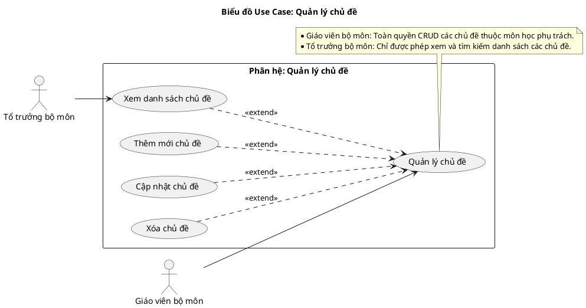
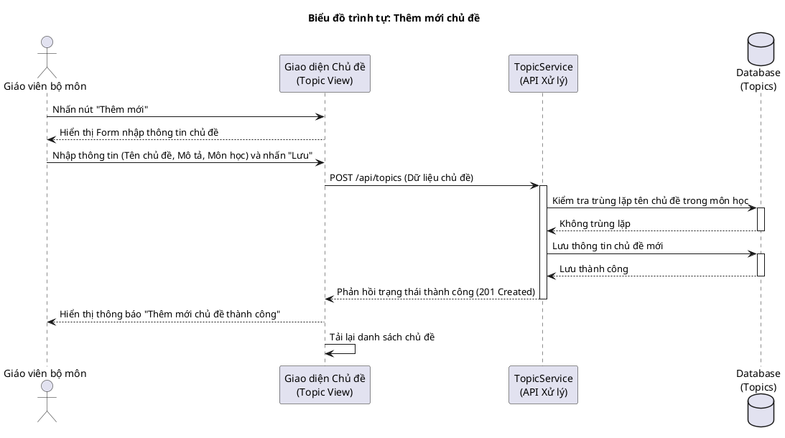
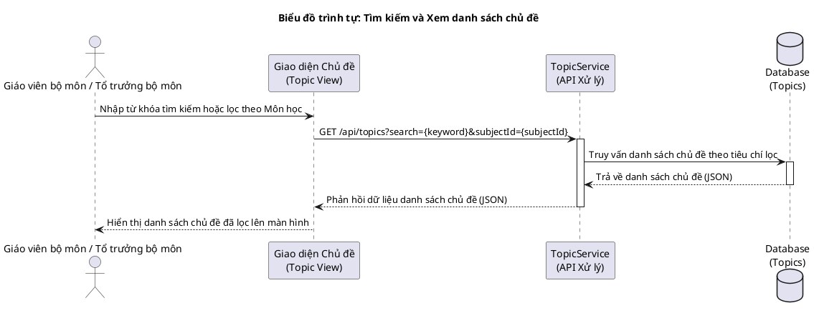
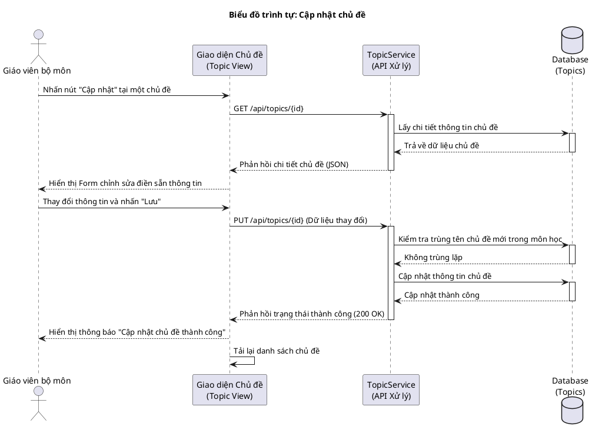
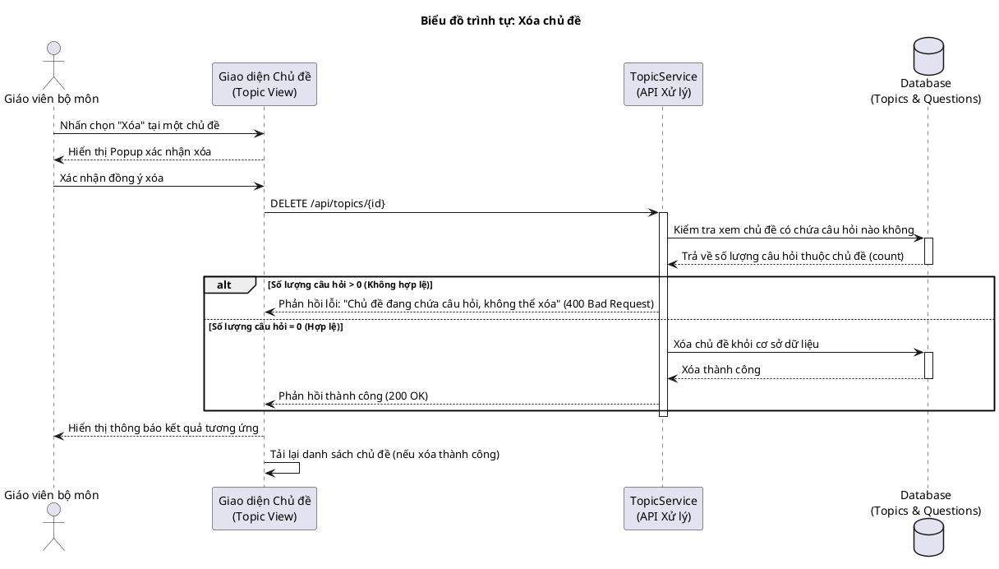
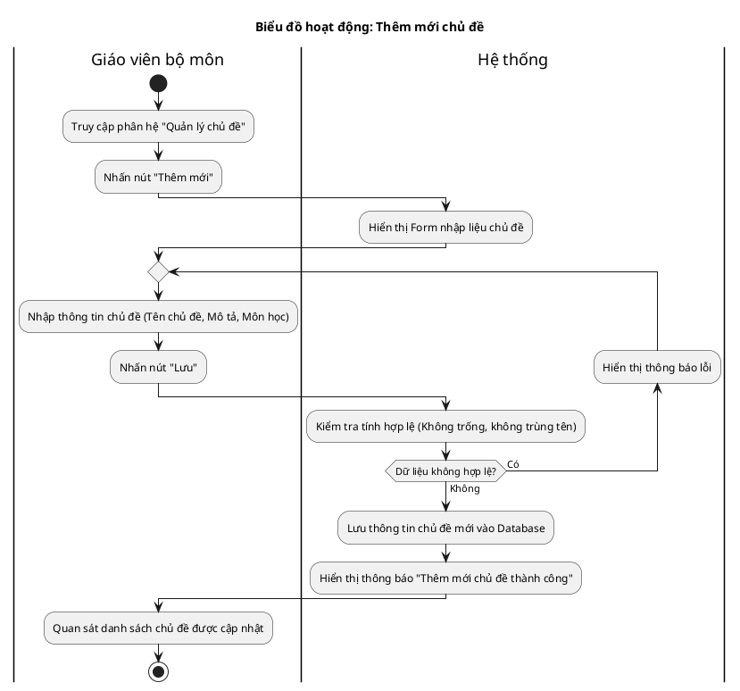
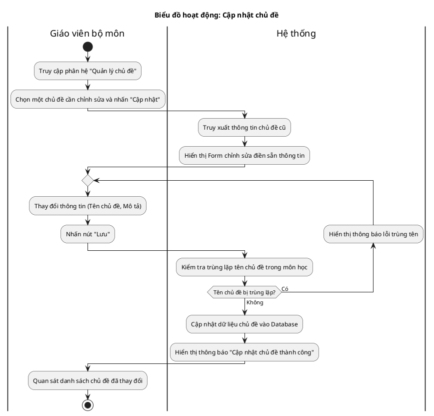
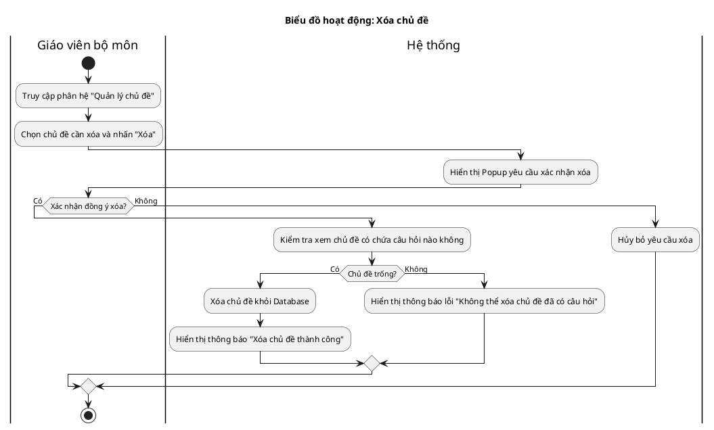

# Tài liệu Đặc tả: Quản lý Chủ Đề (Topic Management)

## 1. Bảng Use Case chức năng

*Bảng 2.7. Bảng usecase chức năng quản lý chủ đề*

| Tên Use case           | Tác nhân                    | Giao dịch                                                                                                              | Độ phức tạp |
| :---------------------- | :---------------------------- | :---------------------------------------------------------------------------------------------------------------------- | :-------------- |
| **Quản lý chủ đề**     | **Giáo viên bộ môn (GVBM)**   |                                                                                                                         | Trung bình     |
|                         |                               | Giáo viên bộ môn xem danh sách các chủ đề thuộc môn học phụ trách. Hệ thống hiển thị danh sách chủ đề.                 |                 |
|                         |                               | Giáo viên bộ môn thực hiện tìm kiếm, lọc danh sách chủ đề. Hệ thống lọc và hiển thị kết quả.                             |                 |
|                         |                               | Giáo viên bộ môn tạo mới chủ đề (nhập tên, mô tả). Hệ thống lưu trữ và tạo chủ đề mới.                                  |                 |
|                         |                               | Giáo viên bộ môn cập nhật thông tin chủ đề. Hệ thống ghi nhận và lưu các thay đổi.                                      |                 |
|                         |                               | Giáo viên bộ môn thực hiện xóa chủ đề. Hệ thống xác nhận và xóa khỏi cơ sở dữ liệu nếu hợp lệ.                         |                 |
|                         | **Tổ trưởng bộ môn (TTBM)**   |                                                                                                                         | Dễ             |
|                         |                               | Tổ trưởng bộ môn xem danh sách các chủ đề của bộ môn mình quản lý. Hệ thống hiển thị danh sách chủ đề.                  |                 |
|                         |                               | Tổ trưởng bộ môn tìm kiếm chủ đề theo tên hoặc môn học. Hệ thống hiển thị kết quả lọc.                                  |                 |

---

## 2. Biểu đồ Use Case (Use Case Diagram)

**Mô tả:** Biểu đồ minh họa sự tương tác của Giáo viên bộ môn (GVBM) và Tổ trưởng bộ môn (TTBM) đối với phân hệ quản lý chủ đề. Giáo viên bộ môn được thực hiện toàn bộ các chức năng CRUD, trong khi Tổ trưởng bộ môn chỉ có quyền xem và tra cứu/tìm kiếm danh sách chủ đề.

**Mục tiêu:** Thể hiện trực quan sự phân quyền truy cập và thao tác đối với thực thể Chủ đề trong ngân hàng câu hỏi.

---

## 3. Biểu đồ Trình tự chức năng (Sequence Diagram)

### Biểu đồ trình tự 1: Thêm mới chủ đề

**Mô tả:** Diễn giải quy trình tương tác khi Giáo viên bộ môn thêm mới một chủ đề vào môn học. Hệ thống sẽ validate kiểm tra trùng lặp tên chủ đề trước khi lưu.

### Biểu đồ trình tự 2: Tìm kiếm và Xem danh sách chủ đề

**Mô tả:** Diễn giải quy trình khi Giáo viên bộ môn hoặc Tổ trưởng bộ môn thực hiện tìm kiếm và tra cứu danh sách chủ đề trên hệ thống.

### Biểu đồ trình tự 3: Cập nhật chủ đề

**Mô tả:** Diễn giải quy trình tương tác khi Giáo viên bộ môn cập nhật thông tin một chủ đề đã tồn tại. Hệ thống hiển thị form điền sẵn dữ liệu cũ, kiểm tra trùng lặp tên chủ đề mới và lưu các thay đổi.

### Biểu đồ trình tự 4: Xóa chủ đề

**Mô tả:** Diễn giải quy trình tương tác khi Giáo viên bộ môn thực hiện xóa chủ đề. Hệ thống tiến hành kiểm tra xem chủ đề có đang chứa câu hỏi nào không để đảm bảo tính nhất quán dữ liệu trước khi thực hiện xóa.

---

## 4. Biểu đồ Hoạt động (Activity Diagram)

### Biểu đồ hoạt động 1: Thêm mới chủ đề

**Mô tả:** Luồng nghiệp vụ thêm mới một chủ đề kèm theo vòng lặp kiểm tra tính hợp lệ và cảnh báo lỗi nếu trùng tên.

### Biểu đồ hoạt động 2: Cập nhật chủ đề

**Mô tả:** Luồng nghiệp vụ cập nhật thông tin chủ đề hiện có và kiểm tra trùng tên khi thay đổi.

### Biểu đồ hoạt động 3: Xóa chủ đề

**Mô tả:** Luồng nghiệp vụ xóa chủ đề, có kiểm tra ràng buộc xem chủ đề đó đã được sử dụng cho câu hỏi nào chưa để ngăn chặn lỗi toàn vẹn dữ liệu.

