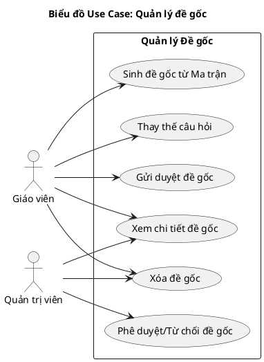
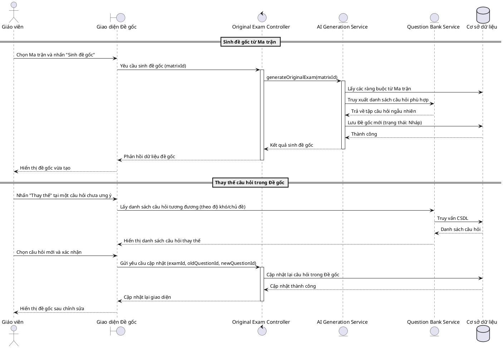
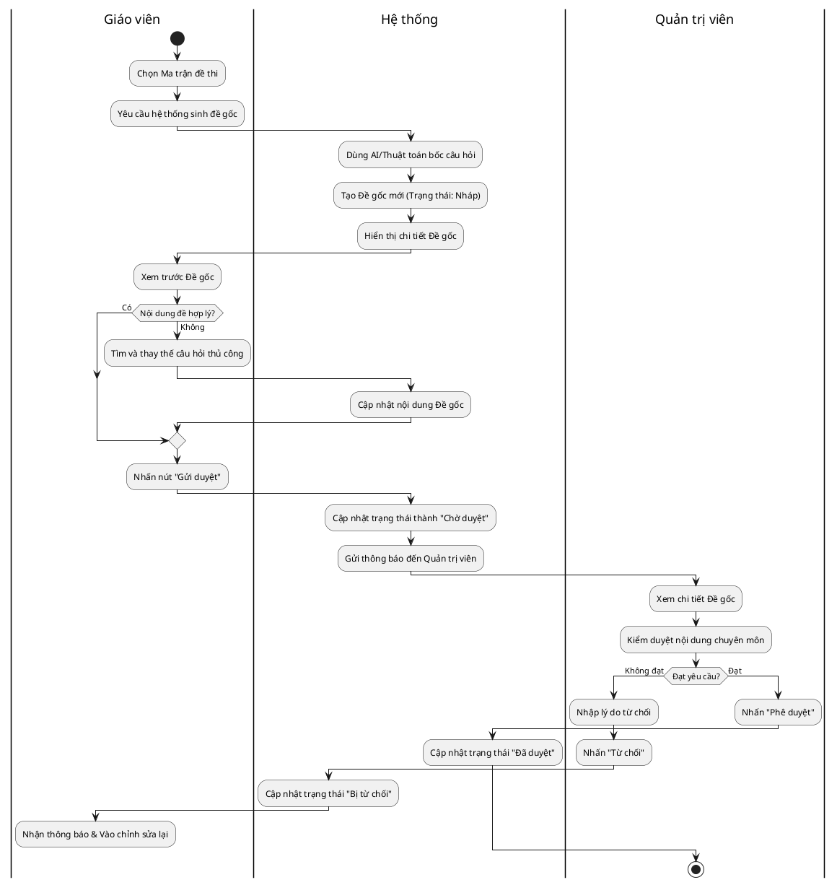
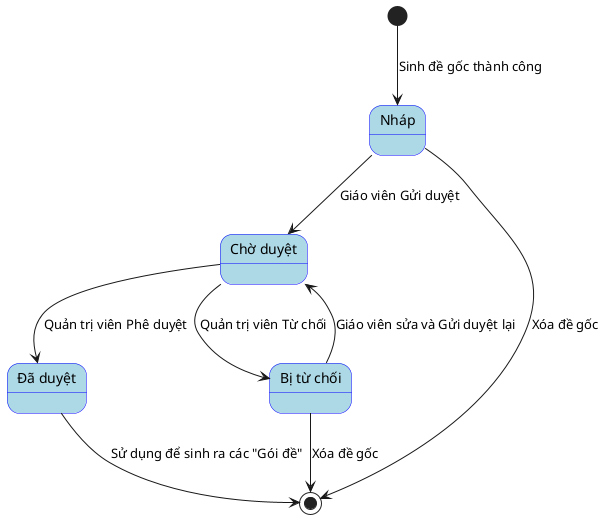

# Phân tích thiết kế phân hệ Quản lý Đề gốc

## 1. Tác nhân (Actors)

Phân hệ Quản lý Đề gốc bao gồm 2 tác nhân chính tham gia:

- **Giáo viên / Người ra đề (Teacher)**: Là người thao tác chọn ma trận để sinh ra Đề gốc. Giáo viên có quyền xem trước, thay thế các câu hỏi không phù hợp và gửi đề gốc lên hệ thống để xin duyệt.
- **Quản trị viên / Trưởng bộ môn (Admin)**: Là người chịu trách nhiệm về chuyên môn, thực hiện việc kiểm duyệt nội dung của Đề gốc. Có quyền quyết định Phê duyệt (Approve) hoặc Từ chối (Reject) đề gốc.

## 2. Bảng mô tả Use Case chức năng

| Tên Use case                 | Tác nhân                    | Giao dịch                                                                                                                                                | Độ phức tạp |
| ----------------------------- | ----------------------------- | --------------------------------------------------------------------------------------------------------------------------------------------------------- | --------------- |
| **Quản lý đề gốc** | Giáo viên, Quản trị viên |                                                                                                                                                           | Cao             |
|                               |                               | Giáo viên có thể yêu cầu hệ thống sinh đề gốc tự động. Hệ thống tạo đề gốc dựa trên thuật toán/AI và lưu vào cơ sở dữ liệu |                 |
|                               |                               | Giáo viên, Quản trị viên có thể xem chi tiết danh sách câu hỏi, đáp án của đề gốc. Hệ thống hiển thị chi tiết đề gốc            |                 |
|                               |                               | Giáo viên có thể thay thế câu hỏi trong đề gốc. Hệ thống cập nhật lại nội dung đề gốc trong cơ sở dữ liệu                          |                 |
|                               |                               | Giáo viên có thể gửi duyệt đề gốc. Hệ thống chuyển trạng thái đề sang chờ duyệt                                                         |                 |
|                               |                               | Quản trị viên có thể phê duyệt hoặc từ chối đề gốc. Hệ thống cập nhật trạng thái đề gốc tương ứng                                |                 |
|                               |                               | Giáo viên, Quản trị viên có thể xóa đề gốc (nếu chưa dùng sinh gói đề). Hệ thống xóa đề gốc khỏi cơ sở dữ liệu                |                 |

---

## 3. Biểu đồ Use Case (Use Case Diagram)

---

## 4. Biểu đồ Trình tự (Sequence Diagram)

Biểu đồ trình tự mô tả nghiệp vụ **Sinh đề gốc tự động và Thay thế câu hỏi thủ công**.

---

## 5. Biểu đồ Hoạt động (Activity Diagram)

Biểu đồ mô tả quy trình luân chuyển từ khi sinh đề gốc đến khi được Quản trị viên phê duyệt.

---

## 6. Biểu đồ Trạng thái (State Diagram)

Biểu đồ mô tả vòng đời của một Đề gốc từ khi được sinh ra.

