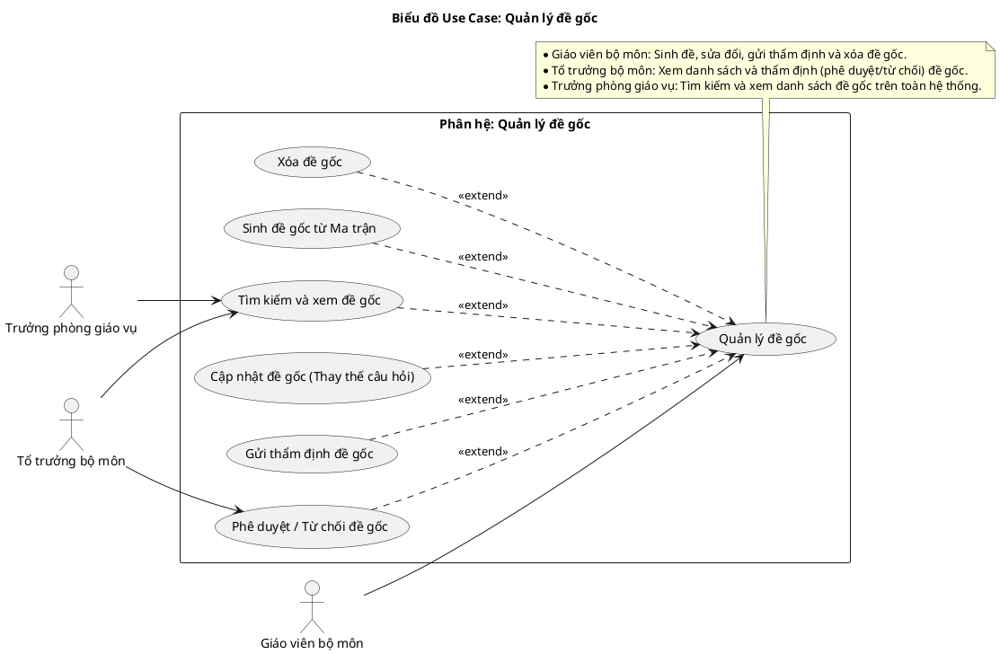
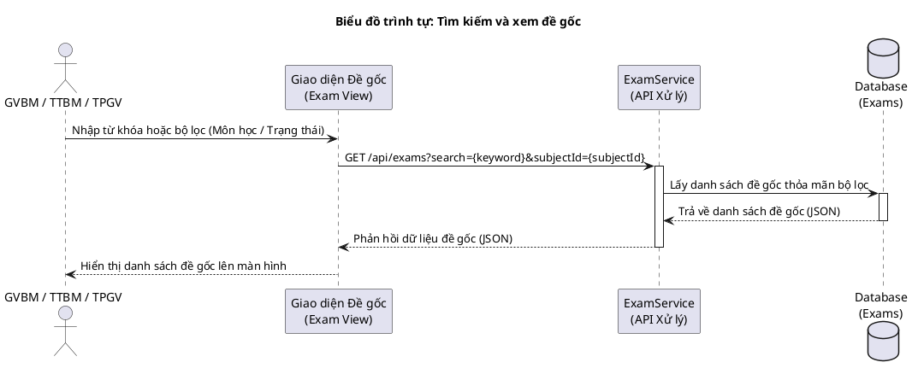
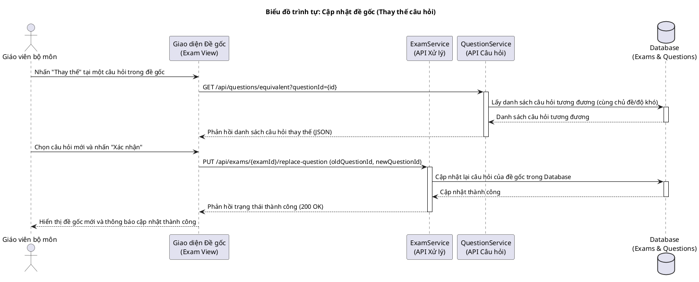
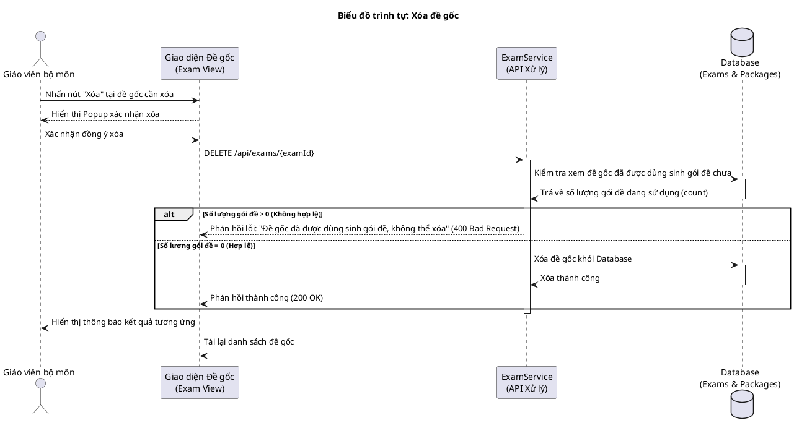
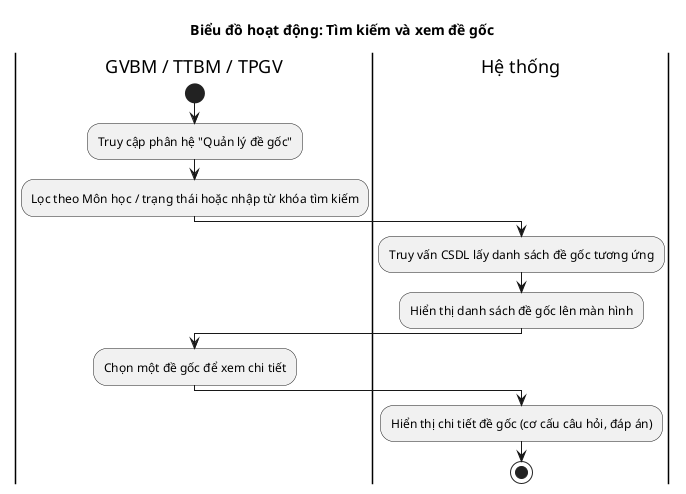
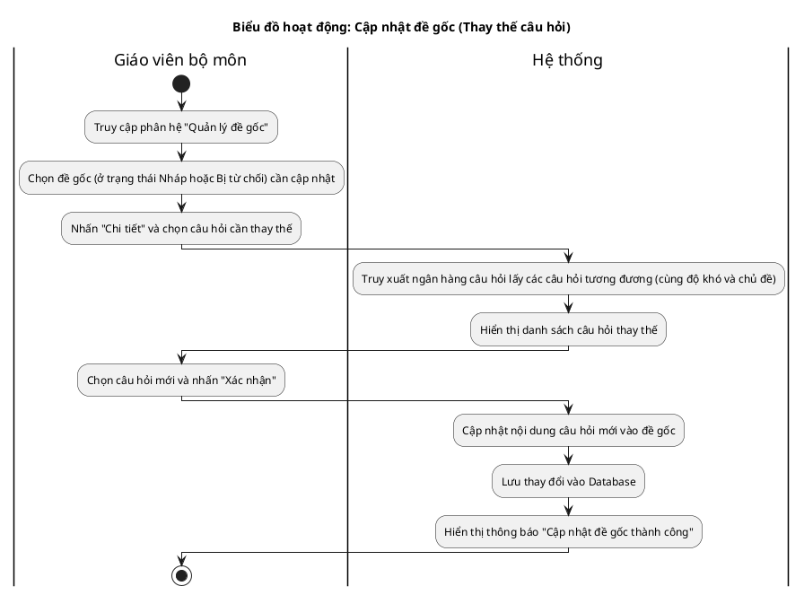
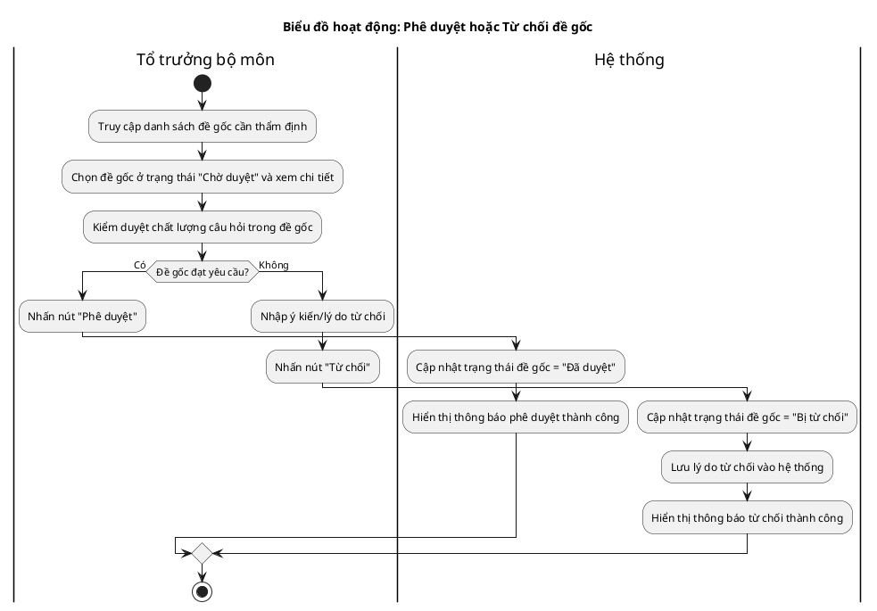
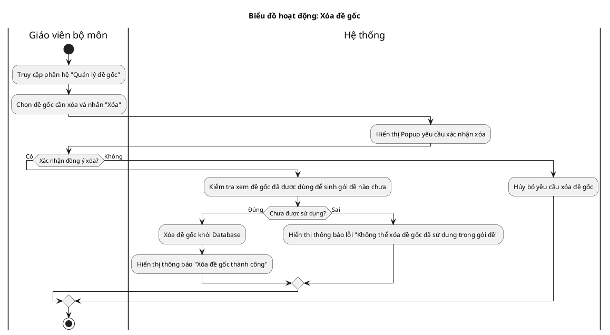

# Tài liệu Đặc tả: Quản lý Đề gốc (Base Exam Management)

## 1. Bảng Use Case chức năng

*Bảng 2.12. Bảng usecase chức năng quản lý đề gốc*

| Tên Use case                 | Tác nhân                                     | Giao dịch                                                                                                                                                | Độ phức tạp |
| ----------------------------- | -------------------------------------------- | --------------------------------------------------------------------------------------------------------------------------------------------------------- | --------------- |
| **Quản lý đề gốc**            | **Giáo viên bộ môn (GVBM)**                  |                                                                                                                                                           | Phức tạp        |
|                               |                                              | Giáo viên bộ môn có thể yêu cầu hệ thống sinh đề gốc tự động. Hệ thống tạo đề gốc dựa trên thuật toán/AI và lưu vào cơ sở dữ liệu.                       |                 |
|                               |                                              | Giáo viên bộ môn có thể xem chi tiết danh sách câu hỏi, đáp án của đề gốc. Hệ thống hiển thị chi tiết đề gốc.                                            |                 |
|                               |                                              | Giáo viên bộ môn thực hiện cập nhật đề gốc (tìm và thay thế các câu hỏi không phù hợp bằng câu hỏi tương đương). Hệ thống cập nhật lại nội dung đề gốc.  |                 |
|                               |                                              | Giáo viên bộ môn gửi thẩm định đề gốc. Hệ thống chuyển trạng thái đề gốc sang Chờ duyệt.                                                                 |                 |
|                               |                                              | Giáo viên bộ môn thực hiện xóa đề gốc. Hệ thống xóa đề gốc khỏi cơ sở dữ liệu nếu đề chưa được dùng sinh gói đề.                                          |                 |
|                               | **Tổ trưởng bộ môn (TTBM)**                  |                                                                                                                                                           | Phức tạp        |
|                               |                                              | Tổ trưởng bộ môn thực hiện tìm kiếm và xem danh sách đề gốc thuộc phạm vi bộ môn quản lý. Hệ thống hiển thị danh sách.                                    |                 |
|                               |                                              | Tổ trưởng bộ môn kiểm duyệt nội dung chuyên môn và phê duyệt hoặc từ chối đề gốc. Hệ thống cập nhật trạng thái tương ứng.                                |                 |
|                               | **Trưởng phòng giáo vụ (TPGV)**               |                                                                                                                                                           | Dễ              |
|                               |                                              | Trưởng phòng giáo vụ thực hiện tìm kiếm và xem danh sách đề gốc trên toàn hệ thống để giám sát chất lượng đề thi.                                         |                 |

---

## 2. Biểu đồ Use Case (Use Case Diagram)

**Mô tả:** Biểu đồ thể hiện các tương tác của Giáo viên bộ môn (GVBM), Tổ trưởng bộ môn (TTBM) và Trưởng phòng giáo vụ (TPGV) đối với phân hệ quản lý đề gốc. GVBM phụ trách sinh đề, cập nhật câu hỏi, gửi thẩm định và xóa đề gốc. TTBM thực hiện xem và duyệt đề gốc. TPGV có quyền xem và tra cứu danh sách đề gốc toàn cục.

**Mục tiêu:** Định hình quy trình nghiệp vụ phối hợp chuyên môn khép kín từ khâu sinh đề nháp cho đến thẩm định và lưu trữ giám sát đề thi.

---

## 3. Biểu đồ Trình tự chức năng (Sequence Diagram)

### Biểu đồ trình tự 1: Tìm kiếm và xem đề gốc

**Mô tả:** Diễn giải luồng dữ liệu khi người dùng (GVBM, TTBM hoặc TPGV) thực hiện tìm kiếm và tra cứu danh sách đề gốc.

### Biểu đồ trình tự 2: Cập nhật đề gốc (Thay thế câu hỏi)

**Mô tả:** Diễn giải luồng tương tác khi Giáo viên bộ môn chỉnh sửa cập nhật đề gốc bằng cách thay thế câu hỏi chưa phù hợp bằng một câu hỏi tương đương từ ngân hàng câu hỏi.

### Biểu đồ trình tự 3: Xóa đề gốc

**Mô tả:** Quy trình Giáo viên bộ môn thực hiện xóa đề gốc nháp hoặc đề bị từ chối, có kiểm tra tính toàn vẹn dữ liệu đề thi.

---

## 4. Biểu đồ Hoạt động (Activity Diagram)

### Biểu đồ hoạt động 1: Tìm kiếm và xem đề gốc

**Mô tả:** Tiến trình tra cứu và hiển thị chi tiết đề gốc của các tác nhân GVBM, TTBM, TPGV.

### Biểu đồ hoạt động 2: Cập nhật đề gốc (Thay thế câu hỏi)

**Mô tả:** Tiến trình Giáo viên bộ môn thay thế câu hỏi trong đề gốc để cập nhật lại nội dung.

### Biểu đồ hoạt động 3: Phê duyệt hoặc Từ chối đề gốc

**Mô tả:** Tiến trình thẩm định và duyệt đề gốc của Tổ trưởng bộ môn.

### Biểu đồ hoạt động 4: Xóa đề gốc

**Mô tả:** Tiến trình Giáo viên bộ môn thực hiện xóa đề gốc khi không còn sử dụng.

---

## 5. Biểu đồ Trạng thái (State Diagram)

**Mô tả:** Biểu đồ mô tả vòng đời trạng thái của một Đề gốc kể từ khi được khởi tạo tự động dưới dạng Nháp đến khi được Phê duyệt và chuyển tiếp cho các khâu tiếp theo.

