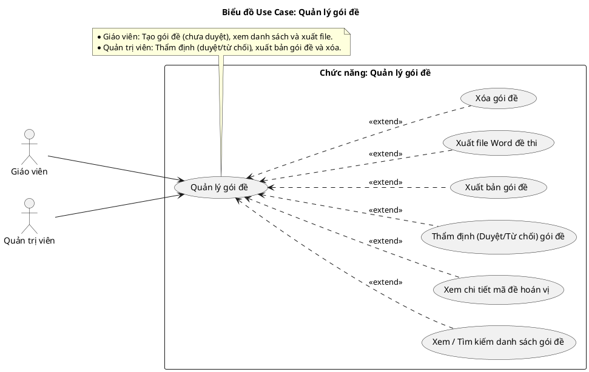
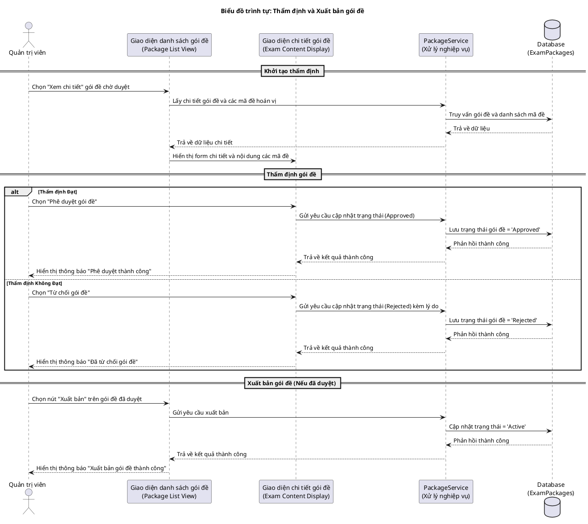
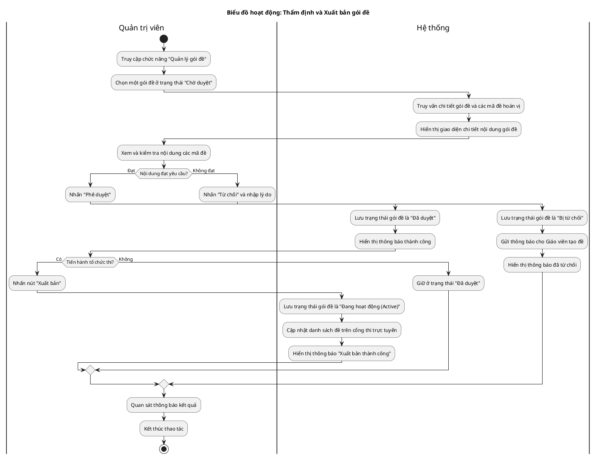
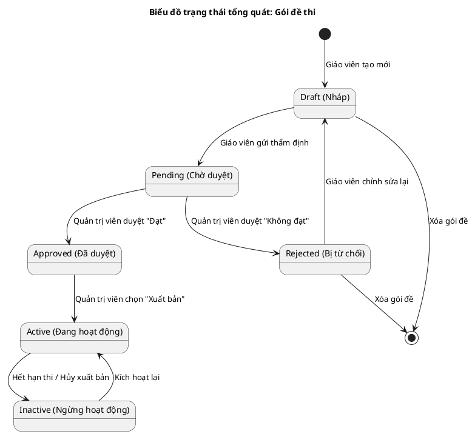

# Tài liệu Đặc tả: Quản lý Gói Đề (Package Management)

## 1. Bảng Use Case chức năng

*Bảng 2.4. Bảng usecase chức năng quản lý gói đề*

| Tên Use case       | Tác nhân                    | Giao dịch                                                                                                                   | Độ phức tạp |
| :------------------ | :---------------------------- | :--------------------------------------------------------------------------------------------------------------------------- | :-------------- |
| Quản lý gói đề | Giáo viên, Quản trị viên |                                                                                                                              | Phức tạp      |
|                     |                               | Giáo viên có thể tạo và gửi duyệt gói đề. Hệ thống cập nhật trạng thái gói đề chờ duyệt                |                 |
|                     |                               | Quản trị viên có thể phê duyệt gói đề. Hệ thống cập nhật trạng thái gói đề đã duyệt                    |                 |
|                     |                               | Quản trị viên có thể từ chối gói đề. Hệ thống cập nhật trạng thái gói đề bị từ chối                    |                 |
|                     |                               | Quản trị viên có thể xuất bản gói đề. Hệ thống cập nhật trạng thái gói đề sang đang hoạt động         |                 |
|                     |                               | Quản trị viên có thể ngừng xuất bản gói đề. Hệ thống cập nhật trạng thái gói đề sang ngưng hoạt động |                 |
|                     |                               | Người dùng có thể tra cứu danh sách gói đề. Hệ thống hiển thị kết quả tra cứu gói đề                     |                 |
|                     |                               | Người dùng có thể xem chi tiết mã đề hoán vị. Hệ thống hiển thị chi tiết nội dung mã đề                  |                 |
|                     |                               | Người dùng có thể xuất file Word đề thi. Hệ thống tạo và tải xuống file Word đề thi                          |                 |
|                     |                               | Quản trị viên có thể xóa gói đề. Hệ thống xóa gói đề                                                          |                 |

## 2. Biểu đồ Use Case (Use Case Diagram)

**Mô tả:** Biểu đồ Use Case thể hiện sự tương tác của hai tác nhân chính (Giáo viên và Quản trị viên) với hệ thống trong quy trình quản lý gói đề thi. Các chức năng bao gồm xem danh sách, xem chi tiết mã đề hoán vị, thẩm định (duyệt/từ chối), xuất bản, xuất file Word đề thi và xóa gói đề.

**Mục tiêu:** Cung cấp cái nhìn tổng thể về phân quyền và các thao tác nghiệp vụ, giúp định hình rõ vai trò của Giáo viên (tạo và đề xuất) và Quản trị viên (kiểm duyệt và điều phối trạng thái) trong hệ thống.

## 3. Biểu đồ Trình tự chức năng (Sequence Diagram)

**Mô tả:** Biểu đồ trình diễn chi tiết quy trình giao tiếp giữa Quản trị viên, giao diện người dùng, tầng Service và Cơ sở dữ liệu trong nghiệp vụ Thẩm định và Xuất bản gói đề. Quá trình bao gồm tải dữ liệu chi tiết, thực hiện thao tác phê duyệt hoặc từ chối, và cập nhật trạng thái gói đề sang hoạt động (xuất bản).

**Mục tiêu:** Làm rõ luồng xử lý kỹ thuật và vòng đời trạng thái của gói đề ở tầng hệ thống, đảm bảo quy trình kiểm duyệt diễn ra minh bạch, lưu trữ kết quả chính xác và phản hồi trực quan.

*Biểu đồ trình tự mô tả nghiệp vụ **Thẩm định và Xuất bản gói đề**.*

## 4. Biểu đồ Hoạt động (Activity Diagram)

## 5. Biểu đồ Trạng thái (State Diagram)

