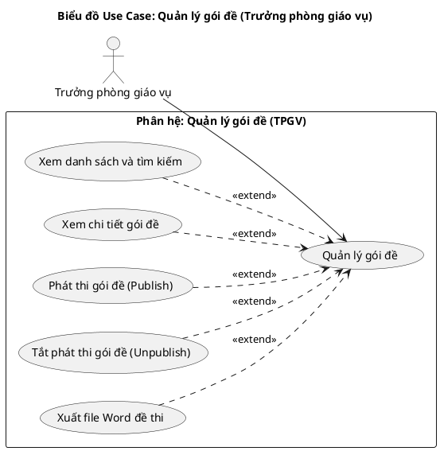
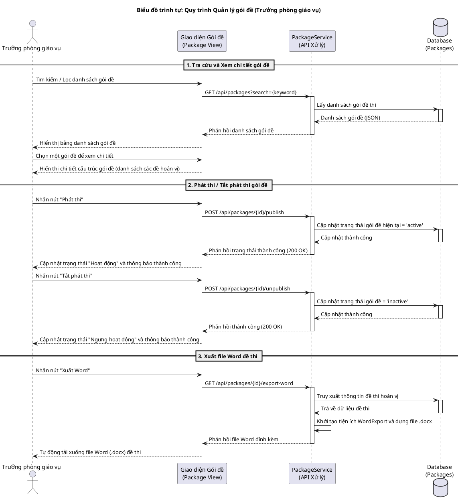
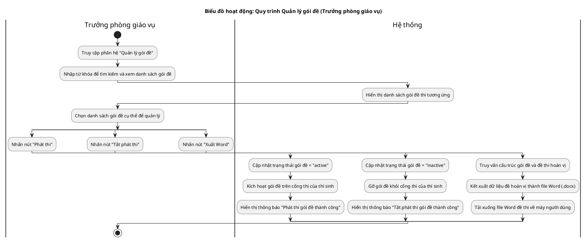
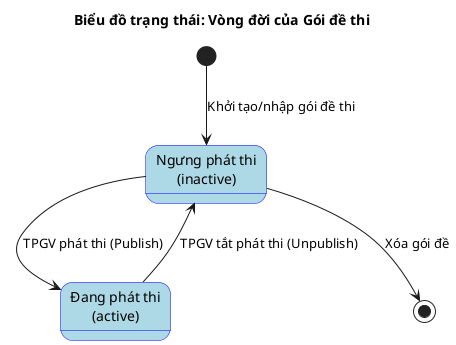

# Tài liệu Đặc tả: Quản lý Gói đề dành cho Trưởng phòng giáo vụ (Exam Package Management)

## 1. Bảng Use Case chức năng

*Bảng 2.4. Bảng usecase chức năng quản lý gói đề của Trưởng phòng giáo vụ*

| Tên Use case           | Tác nhân                    | Giao dịch                                                                                                              | Độ phức tạp |
| :---------------------- | :---------------------------- | :---------------------------------------------------------------------------------------------------------------------- | :-------------- |
| **Quản lý gói đề**      | **Trưởng phòng giáo vụ (TPGV)** |                                                                                                                         | Phức tạp        |
|                         |                               | Trưởng phòng giáo vụ xem danh sách và tìm kiếm các gói đề thi trên hệ thống (gói đề được tạo tự động ngay khi sinh hoán vị từ đề gốc). Hệ thống hiển thị danh sách. |                 |
|                         |                               | Trưởng phòng giáo vụ xem chi tiết cấu trúc gói đề (danh sách các đề thi hoán vị thuộc gói). Hệ thống hiển thị chi tiết. |                 |
|                         |                               | Trưởng phòng giáo vụ thực hiện Phát thi gói đề (Publish) để mang đi thi trực tiếp mà không cần qua khâu thẩm định. Hệ thống đổi trạng thái gói đề sang "active". |                 |
|                         |                               | Trưởng phòng giáo vụ thực hiện Tắt phát thi gói đề (Unpublish). Hệ thống đổi trạng thái sang "inactive".                |                 |
|                         |                               | Trưởng phòng giáo vụ chọn xuất file Word đề thi/đáp án. Hệ thống kết xuất dữ liệu và tải xuống tệp tin Word (.docx).     |                 |

---

**Mô tả:** Biểu đồ mô tả sự tương tác của Trưởng phòng giáo vụ (TPGV) đối với phân hệ quản lý gói đề thi. Gói đề thi được hệ thống tự động khởi tạo ngay khi người dùng thực hiện sinh hoán vị đề thi ở màn hình quản lý đề gốc. TPGV có quyền xem danh sách gói đề này và mang đi phát thi ngay mà không cần qua khâu thẩm định.

**Mục tiêu:** Thể hiện rõ vai trò điều phối kỳ thi của Trưởng phòng giáo vụ trong việc đưa các gói đề thi tự động sinh từ đề gốc vào hoạt động chính thức (Publish) hoặc đóng gói thi sau khi hoàn tất (Unpublish).

---

## 3. Biểu đồ Trình tự chức năng (Sequence Diagram)

**Mô tả:** Biểu đồ trình tự mô tả quy trình tương tác của Trưởng phòng giáo vụ đối với các gói đề thi đã được tạo tự động từ bước sinh hoán vị ở màn hình quản lý đề gốc. TPGV thực hiện phát thi/tắt phát thi trực tiếp và kết xuất file Word đề thi mà không cần qua khâu phê duyệt.

---

## 4. Biểu đồ Hoạt động (Activity Diagram)

**Mô tả:** Biểu đồ hoạt động mô tả tiến trình lựa chọn của Trưởng phòng giáo vụ khi truy cập giao diện quản lý gói đề, phân nhánh qua các thao tác phát thi (Publish), dừng thi (Unpublish) và tải tệp tin đề thi về máy.

---

## 5. Biểu đồ Trạng thái (State Diagram)

**Mô tả:** Biểu đồ trạng thái mô tả vòng đời của một Gói đề thi dưới sự quản lý của Trưởng phòng giáo vụ. Gói đề thi được tự động tạo và đưa vào trạng thái ngưng phát thi (inactive) ngay khi sinh hoán vị từ đề gốc, sau đó TPGV có thể phát thi (active) trực tiếp mà không cần duyệt.

