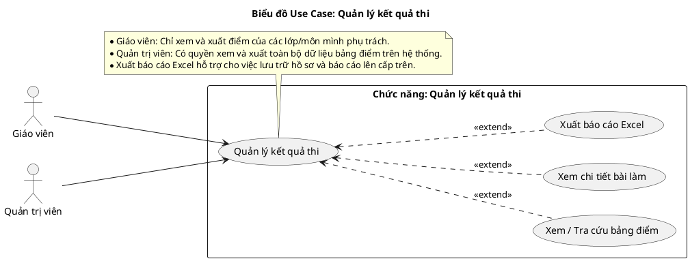
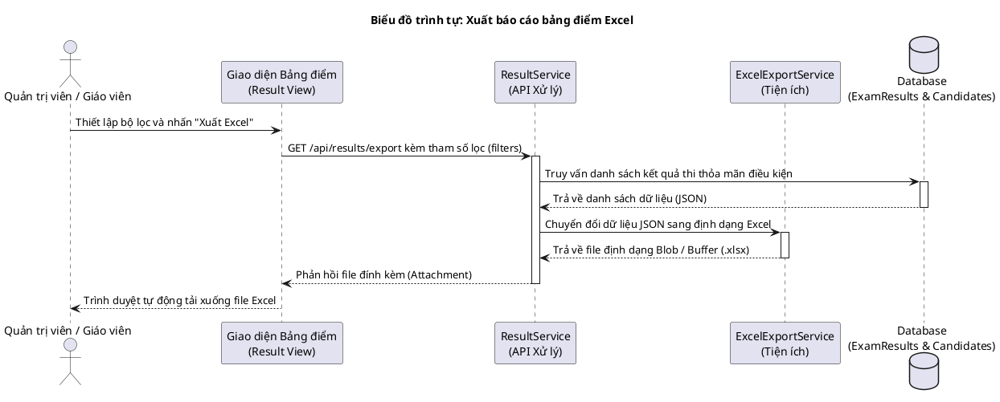
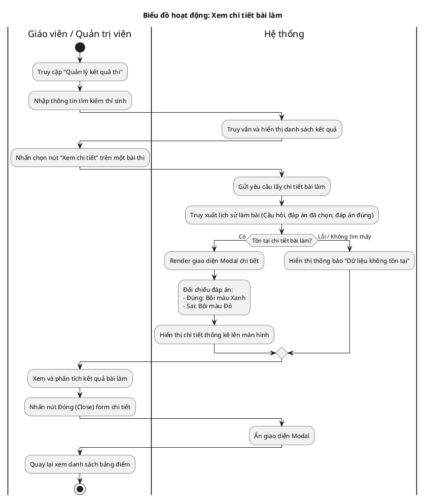

# Tài liệu Đặc tả: Quản lý Kết Quả Thi (Exam Result Management)

## 1. Bảng Use Case chức năng

*Bảng 2.6. Bảng usecase chức năng quản lý kết quả thi*

| Tên Use case           | Tác nhân                    | Giao dịch                                                                                                              | Độ phức tạp |
| :---------------------- | :---------------------------- | :---------------------------------------------------------------------------------------------------------------------- | :-------------- |
| Quản lý kết quả thi | Giáo viên, Quản trị viên |                                                                                                                         | Trung bình     |
|                         |                               | Người dùng có thể tìm kiếm, tra cứu danh sách kết quả thi. Hệ thống hiển thị bảng điểm                |                 |
|                         |                               | Người dùng có thể xem chi tiết bài làm. Hệ thống hiển thị chi tiết lịch sử câu trả lời của thí sinh |                 |
|                         |                               | Người dùng có thể xuất dữ liệu bảng điểm. Hệ thống tạo và tải xuống file Excel báo cáo               |                 |

## 2. Biểu đồ Use Case (Use Case Diagram)

**Mô tả:** Biểu đồ minh họa tương tác của Giáo viên và Quản trị viên đối với phân hệ quản lý kết quả thi. Từ chức năng gốc "Quản lý kết quả thi", người dùng có thể thực hiện các thao tác mở rộng (`<<extend>>`) như xem tra cứu bảng điểm, xem chi tiết bài làm của từng thí sinh, hoặc kết xuất báo cáo ra file Excel.

**Mục tiêu:** Định hình rõ các chức năng thống kê điểm số, đồng thời làm nổi bật phân định quyền truy cập dữ liệu giữa các vai trò (Giáo viên quản lý lớp của mình, Quản trị viên quản lý toàn bộ hệ thống).

## 3. Biểu đồ Trình tự chức năng (Sequence Diagram)

*Biểu đồ trình tự mô tả nghiệp vụ **Xuất báo cáo bảng điểm (Export Excel)**.*

**Mô tả:** Biểu đồ diễn giải chuỗi tương tác theo thời gian khi người dùng yêu cầu xuất bảng điểm. Lớp Giao diện gửi các tiêu chí lọc xuống Service. Service thực hiện truy vấn Database để lấy danh sách kết quả, sau đó gọi dịch vụ tiện ích (`ExcelExportService`) để chuyển đổi khối dữ liệu thành file `.xlsx` và phản hồi về cho trình duyệt tải xuống.

**Mục tiêu:** Làm rõ quy trình gọi hàm và luân chuyển dữ liệu giữa các thành phần phần mềm (UI, Service, Utility, Database) nhằm thực thi tính năng kết xuất báo cáo, đảm bảo ứng dụng xử lý trơn tru các luồng dữ liệu thống kê.

## 4. Biểu đồ Hoạt động (Activity Diagram)

*Biểu đồ hoạt động mô tả luồng **Xem chi tiết bài làm của thí sinh**.*

