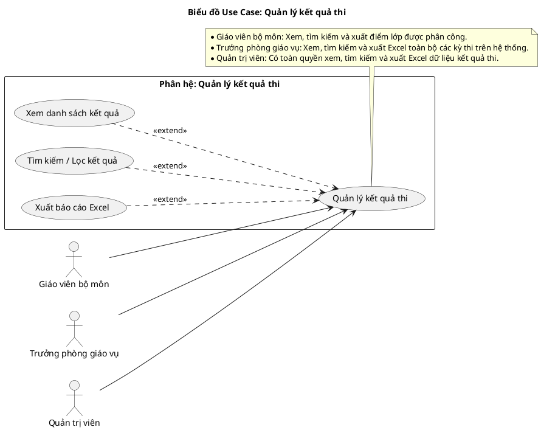
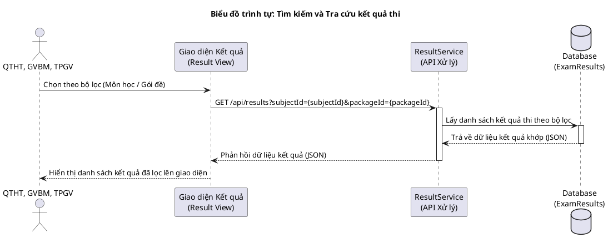
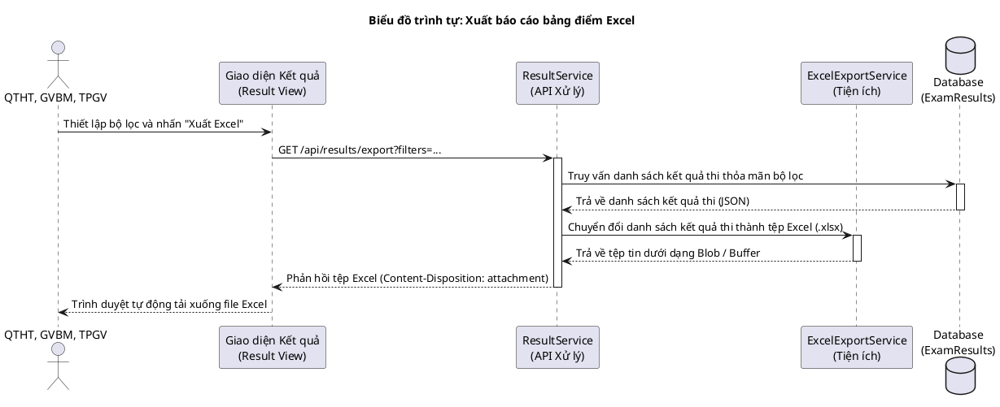
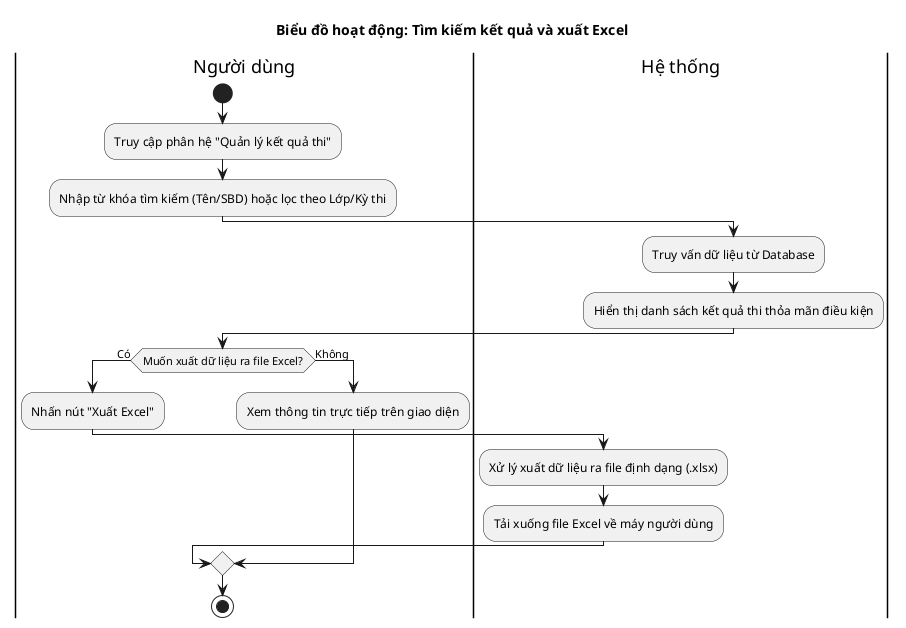

# Tài liệu Đặc tả: Quản lý Kết Quả Thi (Exam Result Management)

## 1. Bảng Use Case chức năng

*Bảng 2.6. Bảng usecase chức năng quản lý kết quả thi*

| Tên Use case           | Tác nhân                    | Giao dịch                                                                                                              | Độ phức tạp |
| :---------------------- | :---------------------------- | :---------------------------------------------------------------------------------------------------------------------- | :-------------- |
| **Quản lý kết quả thi** | **Giáo viên bộ môn (GVBM)**   |                                                                                                                         | Trung bình     |
|                         |                               | Giáo viên bộ môn xem danh sách kết quả thi của các môn học/lớp học được phân công. Hệ thống hiển thị bảng điểm. |                 |
|                         |                               | Giáo viên bộ môn thực hiện tìm kiếm, lọc kết quả theo tên hoặc số báo danh. Hệ thống lọc và hiển thị danh sách khớp. |                 |
|                         |                               | Giáo viên bộ môn xuất dữ liệu bảng điểm lớp phụ trách. Hệ thống tạo và tải xuống file Excel báo cáo. |                 |
|                         | **Trưởng phòng giáo vụ (TPGV)**|                                                                                                                         | Trung bình     |
|                         |                               | Trưởng phòng giáo vụ xem danh sách bảng điểm của tất cả kỳ thi/môn học trên hệ thống. Hệ thống hiển thị bảng điểm. |                 |
|                         |                               | Trưởng phòng giáo vụ thực hiện tìm kiếm, lọc kết quả trên toàn hệ thống. Hệ thống lọc và hiển thị danh sách khớp. |                 |
|                         |                               | Trưởng phòng giáo vụ xuất file Excel bảng điểm toàn cục của kỳ thi/môn học. Hệ thống tạo và tải xuống file Excel báo cáo. |                 |
|                         | **Quản trị viên (Admin)**     |                                                                                                                         | Trung bình     |
|                         |                               | Quản trị viên xem danh sách bảng điểm của mọi kỳ thi trên hệ thống. Hệ thống hiển thị bảng điểm. |                 |
|                         |                               | Quản trị viên thực hiện tìm kiếm, lọc kết quả. Hệ thống lọc và hiển thị danh sách khớp. |                 |
|                         |                               | Quản trị viên xuất báo cáo Excel kết quả thi phục vụ công tác quản trị và lưu trữ dữ liệu. |                 |

---

## 2. Biểu đồ Use Case (Use Case Diagram)

**Mô tả:** Biểu đồ minh họa tương tác của Giáo viên bộ môn (GVBM), Trưởng phòng giáo vụ (TPGV) và Quản trị viên (Admin) đối với phân hệ quản lý kết quả thi. Người dùng có thể xem danh sách kết quả thi, thực hiện tìm kiếm/lọc kết quả và kết xuất dữ liệu ra file Excel.

**Mục tiêu:** Thể hiện rõ các chức năng cơ bản của phân hệ và sự khác biệt về phạm vi dữ liệu truy cập của từng tác nhân (GVBM bị giới hạn trong lớp/môn học phân công, TPGV và Admin có quyền xem và xuất Excel toàn cục).

---

## 3. Biểu đồ Trình tự chức năng (Sequence Diagram)

### Biểu đồ trình tự 1: Tìm kiếm và Tra cứu kết quả thi

**Mô tả:** Biểu đồ mô tả quá trình người dùng lọc kết quả thi theo môn học hoặc gói đề. Hệ thống tiếp nhận bộ lọc, truy vấn trong cơ sở dữ liệu và trả về danh sách kết quả thi phù hợp để hiển thị lên màn hình.

### Biểu đồ trình tự 2: Xuất báo cáo bảng điểm Excel

**Mô tả:** Biểu đồ mô tả luồng xử lý khi người dùng yêu cầu tải xuống bảng điểm định dạng Excel (.xlsx) sau khi đã thiết lập bộ lọc phù hợp.

---

## 4. Biểu đồ Hoạt động (Activity Diagram)

### Biểu đồ hoạt động: Tìm kiếm kết quả và xuất Excel

**Mô tả:** Biểu đồ hoạt động mô tả các bước người dùng thực hiện tra cứu thông tin kết quả thi bằng bộ lọc/tìm kiếm, xem kết quả trực tiếp và tùy chọn tải về file Excel báo cáo.

