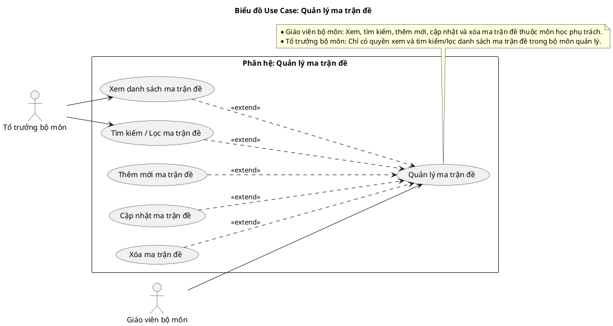
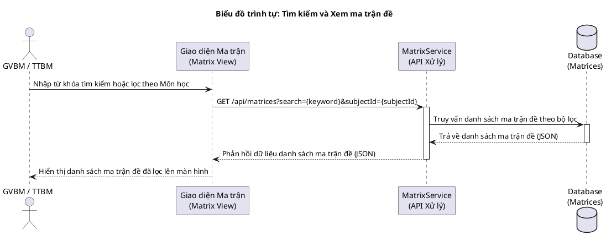
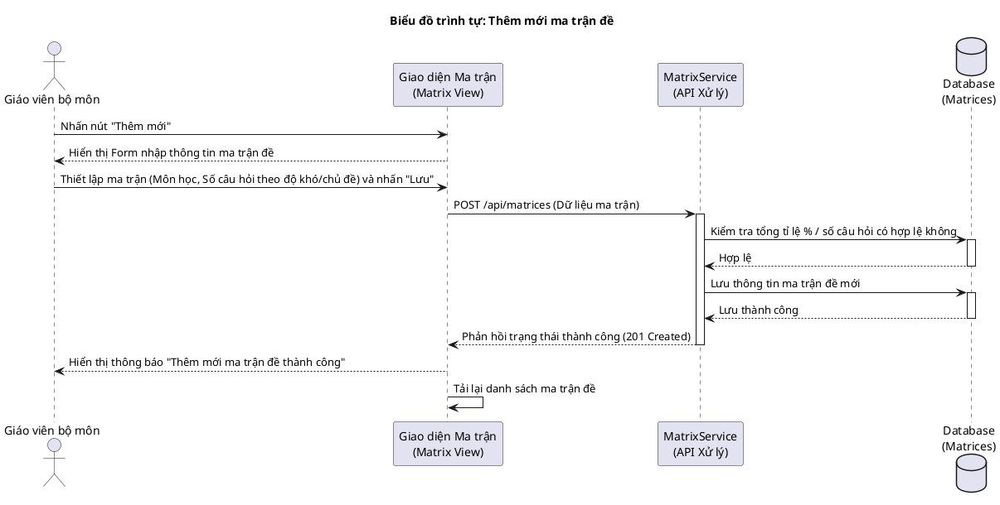
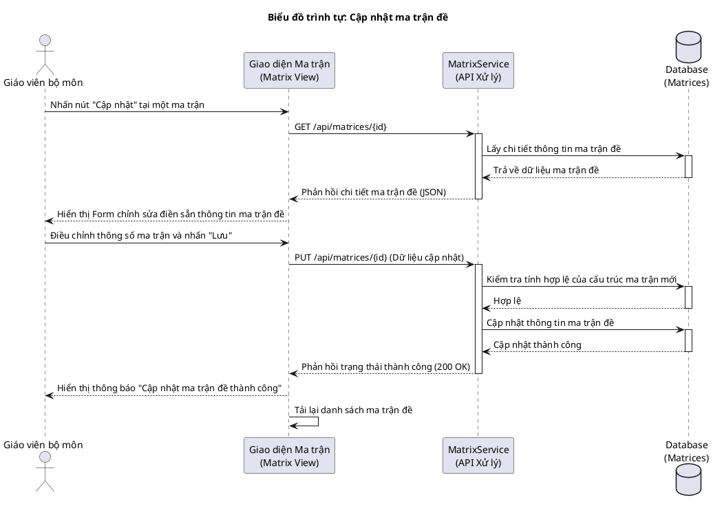
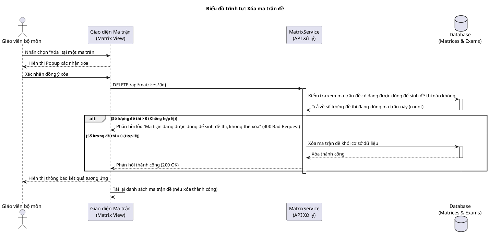
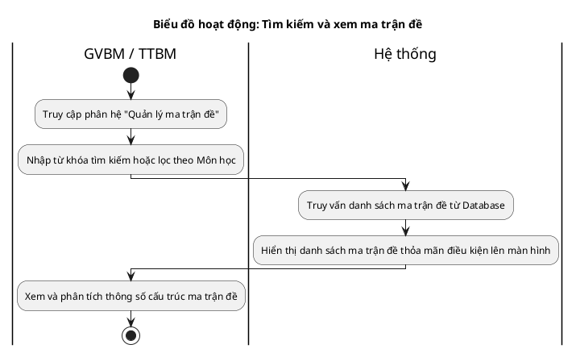
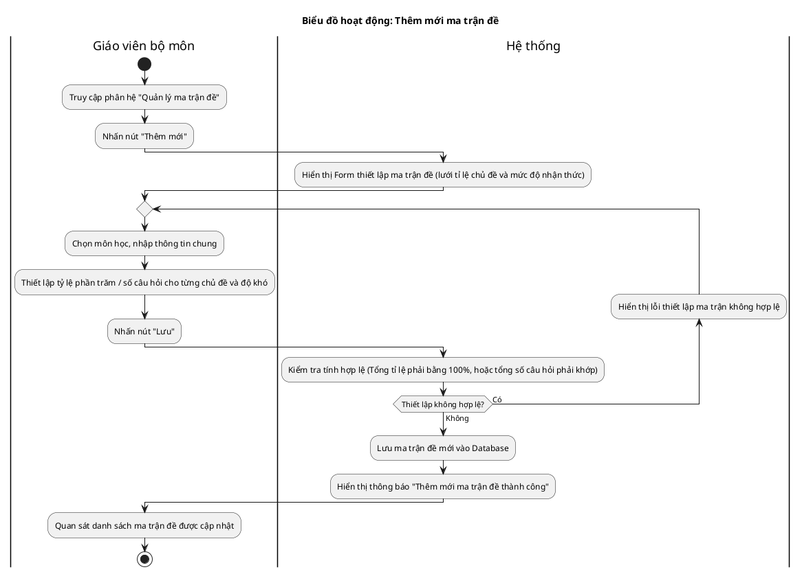
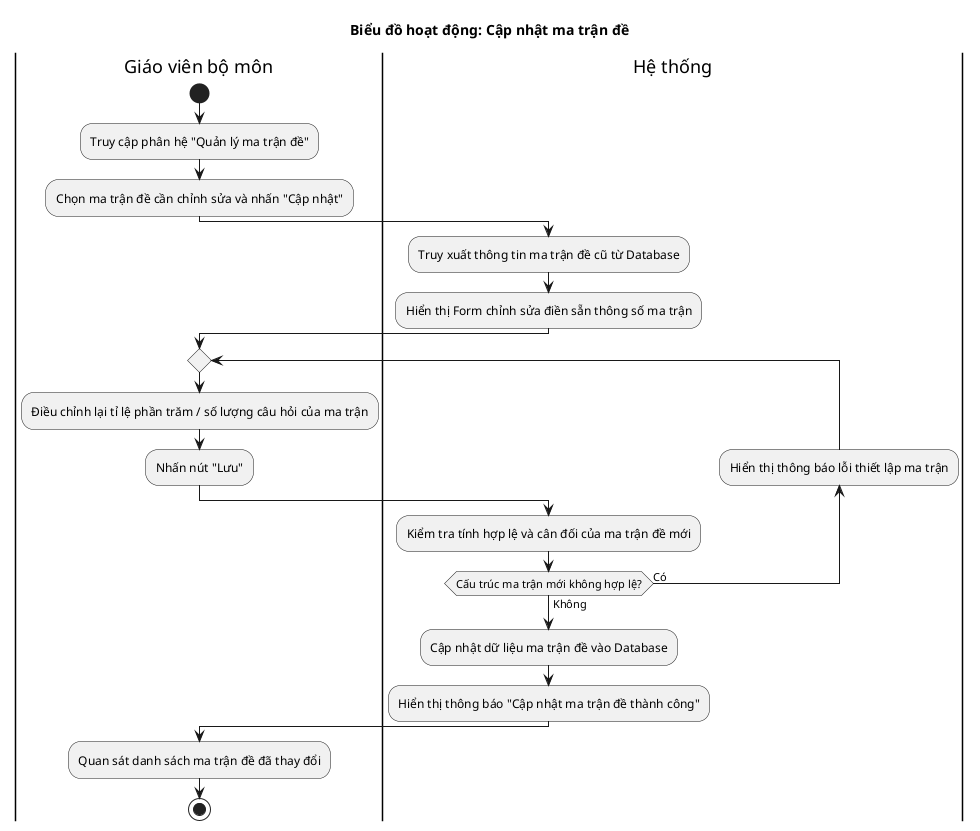
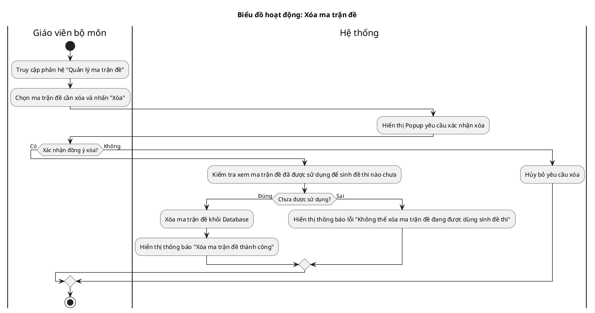

# Tài liệu Đặc tả: Quản lý Ma trận đề (Exam Matrix Management)

## 1. Bảng Use Case chức năng

*Bảng 2.9. Bảng usecase chức năng quản lý ma trận đề*

| Tên Use case           | Tác nhân                    | Giao dịch                                                                                                              | Độ phức tạp |
| :---------------------- | :---------------------------- | :---------------------------------------------------------------------------------------------------------------------- | :-------------- |
| **Quản lý ma trận đề**  | **Giáo viên bộ môn (GVBM)**   |                                                                                                                         | Trung bình     |
|                         |                               | Giáo viên bộ môn xem danh sách các ma trận đề thuộc môn học phụ trách. Hệ thống hiển thị danh sách.                    |                 |
|                         |                               | Giáo viên bộ môn thực hiện tìm kiếm, lọc danh sách ma trận đề. Hệ thống lọc và hiển thị kết quả.                        |                 |
|                         |                               | Giáo viên bộ môn thiết lập thêm mới ma trận đề (tỉ lệ phân bố chủ đề, độ khó). Hệ thống lưu ma trận.                     |                 |
|                         |                               | Giáo viên bộ môn cập nhật cấu trúc ma trận đề. Hệ thống ghi nhận và lưu các thông số thay đổi.                          |                 |
|                         |                               | Giáo viên bộ môn thực hiện xóa ma trận đề. Hệ thống xác nhận và xóa khỏi cơ sở dữ liệu nếu ma trận chưa được dùng sinh đề. |                 |
|                         | **Tổ trưởng bộ môn (TTBM)**   |                                                                                                                         | Dễ             |
|                         |                               | Tổ trưởng bộ môn xem danh sách các ma trận đề của bộ môn mình quản lý. Hệ thống hiển thị danh sách.                     |                 |
|                         |                               | Tổ trưởng bộ môn tìm kiếm ma trận đề theo tên hoặc môn học. Hệ thống hiển thị kết quả lọc.                              |                 |

---

## 2. Biểu đồ Use Case (Use Case Diagram)

**Mô tả:** Biểu đồ minh họa sự tương tác của Giáo viên bộ môn (GVBM) và Tổ trưởng bộ môn (TTBM) đối với phân hệ quản lý ma trận đề. Giáo viên bộ môn được thực hiện toàn bộ các chức năng tạo mới, chỉnh sửa, và xóa ma trận đề; trong khi Tổ trưởng bộ môn chỉ có quyền xem và tra cứu danh sách ma trận đề.

**Mục tiêu:** Thể hiện trực quan sự phân quyền quản trị ma trận cấu trúc đề thi giữa các tác nhân giảng dạy và quản lý tổ bộ môn.

---

## 3. Biểu đồ Trình tự chức năng (Sequence Diagram)

### Biểu đồ trình tự 1: Tìm kiếm và Xem ma trận đề

**Mô tả:** Diễn giải quy trình khi Giáo viên bộ môn hoặc Tổ trưởng bộ môn tìm kiếm và tra cứu danh sách ma trận đề theo các môn học hoặc từ khóa.

### Biểu đồ trình tự 2: Thêm mới ma trận đề

**Mô tả:** Diễn giải quy trình tương tác khi Giáo viên bộ môn thêm mới một ma trận cấu trúc đề. Hệ thống sẽ kiểm tra tính hợp lệ của phân bổ tỉ lệ phần trăm trước khi lưu vào Database.

### Biểu đồ trình tự 3: Cập nhật ma trận đề

**Mô tả:** Diễn giải quy trình tương tác khi Giáo viên bộ môn cập nhật thông số một ma trận đề có sẵn.

### Biểu đồ trình tự 4: Xóa ma trận đề

**Mô tả:** Diễn giải quy trình tương tác khi Giáo viên bộ môn thực hiện xóa ma trận đề. Hệ thống kiểm tra xem ma trận đề đã được dùng để sinh đề thi nào chưa trước khi xóa.

---

## 4. Biểu đồ Hoạt động (Activity Diagram)

### Biểu đồ hoạt động 1: Tìm kiếm và xem ma trận đề

**Mô tả:** Luồng nghiệp vụ khi Giáo viên bộ môn hoặc Tổ trưởng bộ môn thực hiện tìm kiếm và tra cứu các ma trận cấu trúc đề thi.

### Biểu đồ hoạt động 2: Thêm mới ma trận đề

**Mô tả:** Luồng nghiệp vụ thêm mới ma trận đề kèm kiểm tra định dạng và tổng tỷ lệ phần trăm (hoặc số câu hỏi) hợp lệ.

### Biểu đồ hoạt động 3: Cập nhật ma trận đề

**Mô tả:** Luồng nghiệp vụ cập nhật ma trận đề đã có và xác thực lại cấu trúc ma trận mới.

### Biểu đồ hoạt động 4: Xóa ma trận đề

**Mô tả:** Luồng nghiệp vụ xóa ma trận đề, có kiểm tra xem cấu trúc ma trận này đã được dùng sinh đề thi nào hay chưa trước khi tiến hành xóa.

