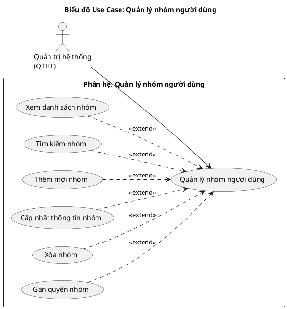
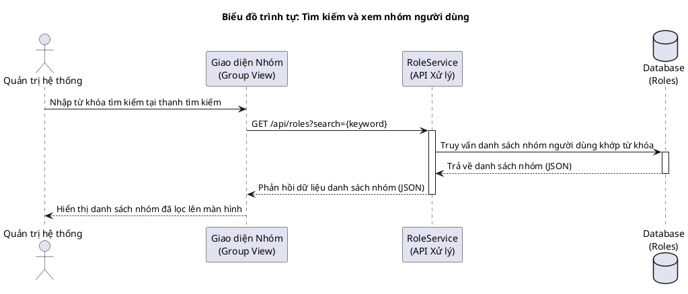
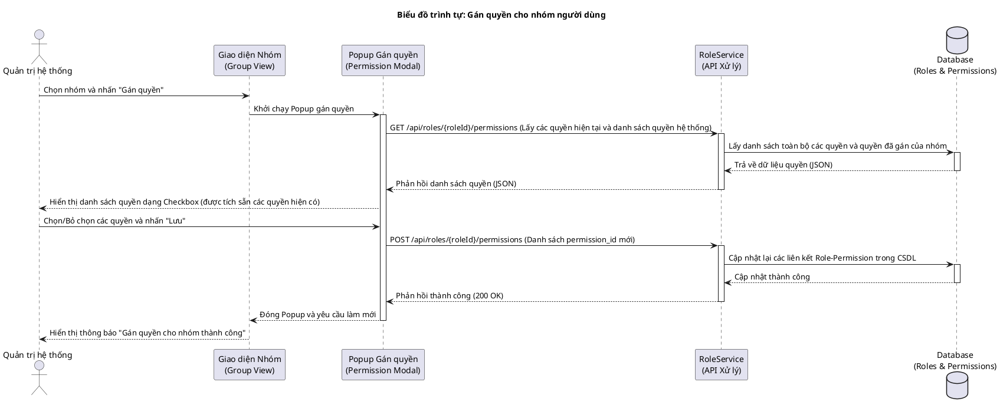
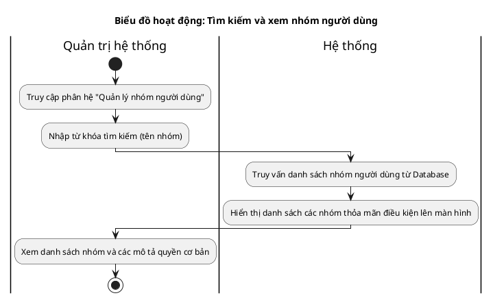
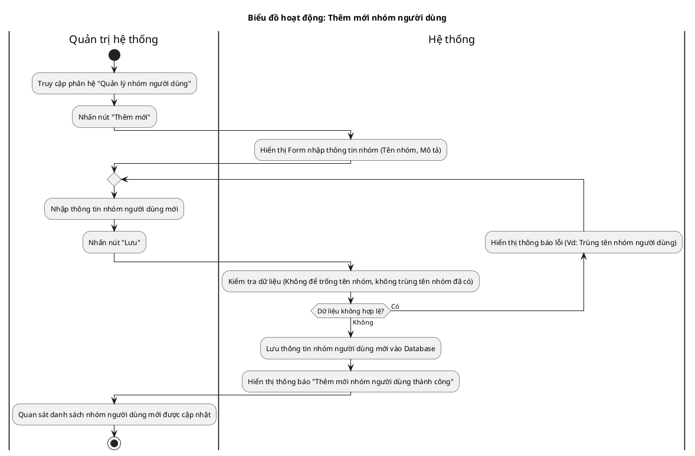
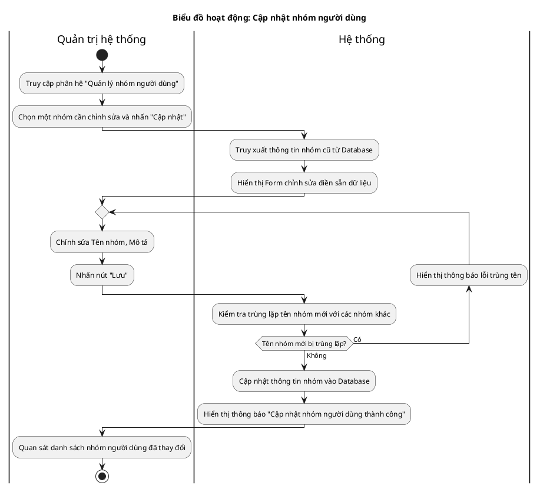
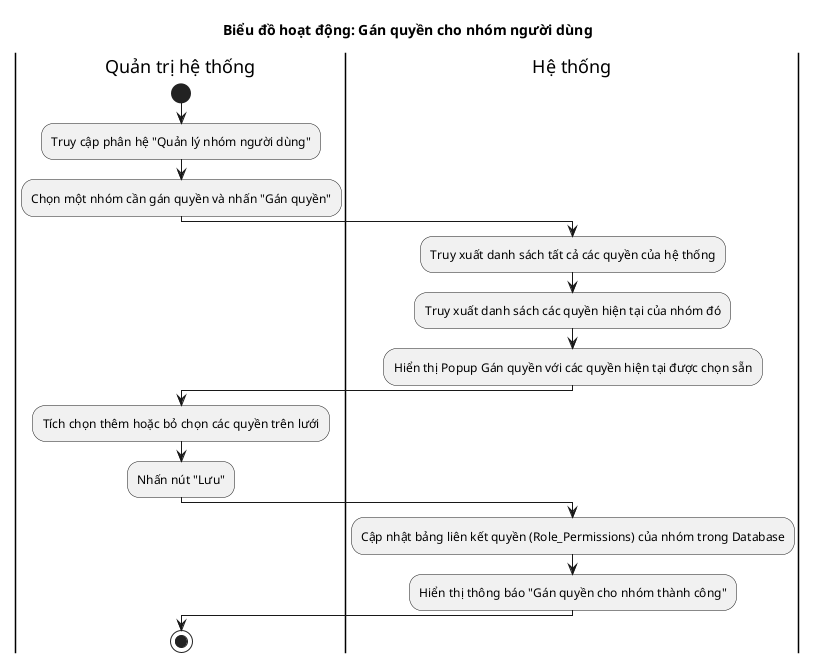
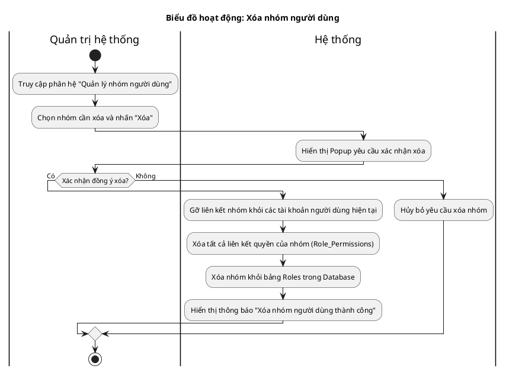

# Tài liệu Đặc tả: Quản lý Nhóm người dùng (User Group Management)

## 1. Bảng Use Case chức năng

*Bảng 2.11. Bảng usecase chức năng quản lý nhóm người dùng*

| Tên Use case           | Tác nhân                    | Giao dịch                                                                                                              | Độ phức tạp |
| :---------------------- | :---------------------------- | :---------------------------------------------------------------------------------------------------------------------- | :-------------- |
| **Quản lý nhóm người dùng** | **Quản trị hệ thống (QTHT)** |                                                                                                                         | Trung bình     |
|                         |                               | Quản trị hệ thống xem danh sách các nhóm người dùng hiện có trong hệ thống. Hệ thống hiển thị bảng danh sách.            |                 |
|                         |                               | Quản trị hệ thống thực hiện tìm kiếm nhóm người dùng theo từ khóa. Hệ thống hiển thị kết quả lọc.                        |                 |
|                         |                               | Quản trị hệ thống tạo mới nhóm người dùng (nhập tên nhóm, mô tả). Hệ thống kiểm tra trùng lặp và tạo nhóm mới.           |                 |
|                         |                               | Quản trị hệ thống cập nhật tên và mô tả của nhóm người dùng. Hệ thống ghi nhận và lưu thay đổi.                         |                 |
|                         |                               | Quản trị hệ thống gán các quyền (Permissions) cụ thể cho nhóm người dùng. Hệ thống cập nhật bảng liên kết quyền.        |                 |
|                         |                               | Quản trị hệ thống thực hiện xóa nhóm người dùng. Hệ thống gỡ liên kết nhóm khỏi các tài khoản người dùng hiện tại và xóa nhóm khỏi cơ sở dữ liệu. |                 |

---

## 2. Biểu đồ Use Case (Use Case Diagram)

**Mô tả:** Biểu đồ minh họa sự tương tác của Quản trị hệ thống (QTHT) đối với phân hệ quản lý nhóm người dùng. QTHT là tác nhân duy nhất thực thi toàn bộ các quyền xem, tìm kiếm, thêm mới, cập nhật, xóa nhóm và gán danh sách quyền cho nhóm.

**Mục tiêu:** Cung cấp giao diện quản lý vai trò và phân quyền tập trung, đảm bảo tính bảo mật và phân quyền chặt chẽ trên toàn hệ thống.

---

## 3. Biểu đồ Trình tự chức năng (Sequence Diagram)

### Biểu đồ trình tự 1: Tìm kiếm và xem nhóm người dùng

**Mô tả:** Diễn giải quy trình khi Quản trị hệ thống thực hiện tìm kiếm và tra cứu danh sách nhóm người dùng theo từ khóa.

### Biểu đồ trình tự 2: Gán quyền cho nhóm người dùng

**Mô tả:** Diễn giải chi tiết luồng xử lý khi Quản trị hệ thống gán hoặc thu hồi các quyền hạn của một nhóm người dùng cụ thể thông qua giao diện Popup Checkbox.

---

## 4. Biểu đồ Hoạt động (Activity Diagram)

### Biểu đồ hoạt động 1: Tìm kiếm và xem nhóm người dùng

**Mô tả:** Tiến trình tìm kiếm và duyệt danh sách các nhóm người dùng của Quản trị hệ thống.

### Biểu đồ hoạt động 2: Thêm mới nhóm người dùng

**Mô tả:** Tiến trình tạo mới một nhóm người dùng, tích hợp vòng lặp xác thực thông tin đầu vào và chống trùng lặp tên nhóm.

### Biểu đồ hoạt động 3: Cập nhật nhóm người dùng

**Mô tả:** Tiến trình sửa thông tin nhóm người dùng hiện có và kiểm tra tính hợp lệ của tên nhóm mới được thay đổi.

### Biểu đồ hoạt động 4: Gán quyền cho nhóm người dùng

**Mô tả:** Tiến trình gán các quyền hệ thống cho nhóm thông qua tương tác giao diện Popup Checkbox.

### Biểu đồ hoạt động 5: Xóa nhóm người dùng

**Mô tả:** Tiến trình xóa nhóm người dùng. Hệ thống tiến hành gỡ liên kết nhóm khỏi các tài khoản người dùng hiện tại, xóa toàn bộ phân quyền liên kết của nhóm và xóa nhóm khỏi cơ sở dữ liệu.

