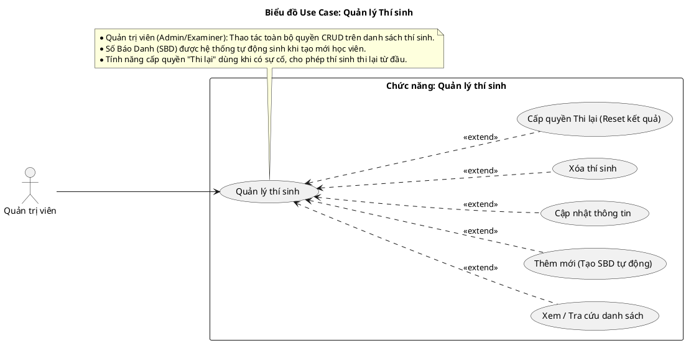
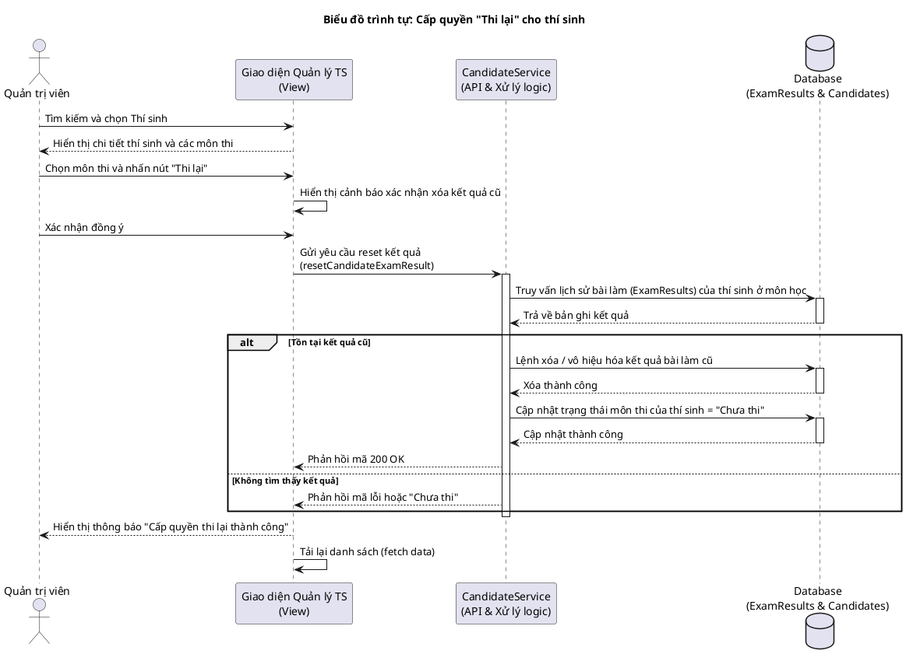
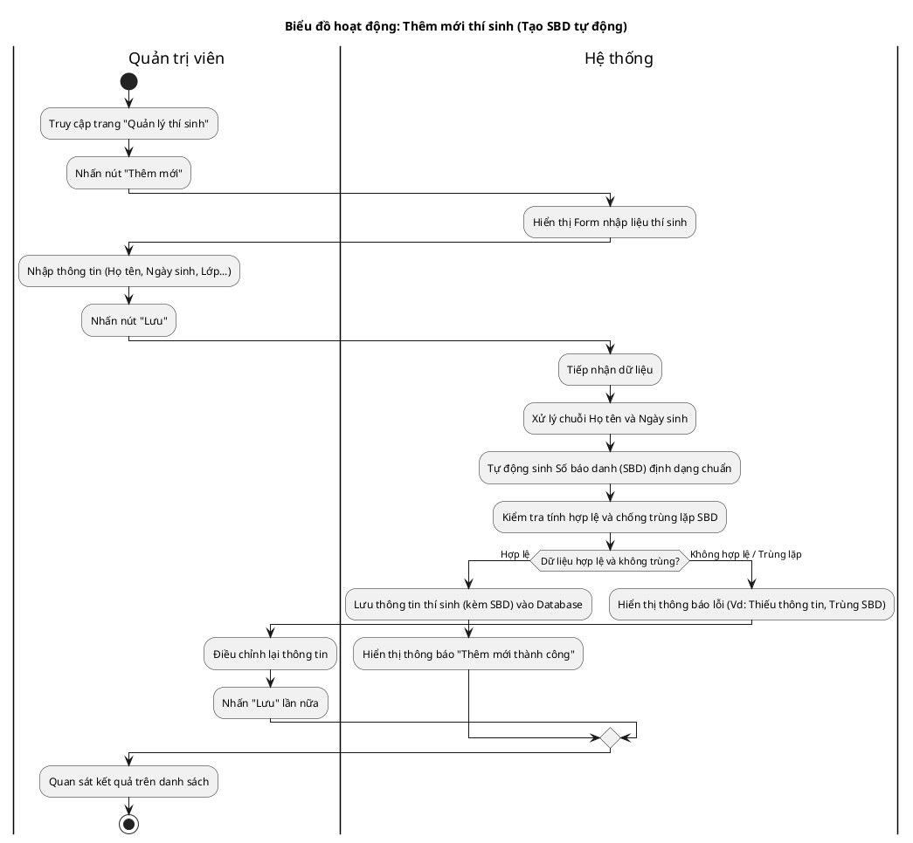

# Tài liệu Đặc tả: Quản lý Thí Sinh (Candidate Management)

## 1. Bảng Use Case chức năng

*Bảng 2.5. Bảng usecase chức năng quản lý thí sinh*

| Tên Use case | Tác nhân | Giao dịch | Độ phức tạp |
| :--- | :--- | :--- | :--- |
| Quản lý thí sinh | Quản trị viên | | Trung bình |
| | | Quản trị viên có thể thêm mới thí sinh. Hệ thống tạo số báo danh tự động và lưu thông tin thí sinh | |
| | | Quản trị viên có thể cập nhật thông tin hồ sơ thí sinh. Hệ thống lưu thay đổi thông tin | |
| | | Quản trị viên có thể xóa hồ sơ thí sinh. Hệ thống xóa thông tin thí sinh khỏi cơ sở dữ liệu | |
| | | Quản trị viên có thể tìm kiếm, tra cứu danh sách thí sinh. Hệ thống hiển thị kết quả tìm kiếm | |
| | | Quản trị viên có thể cấp quyền "Thi lại" cho thí sinh. Hệ thống xóa kết quả thi cũ và mở khóa môn thi | |

## 2. Biểu đồ Use Case (Use Case Diagram)

**Mô tả:** Biểu đồ mô tả sự tương tác giữa Quản trị viên và hệ thống trong phân hệ quản lý thông tin thí sinh. Bao gồm các chức năng cốt lõi: xem danh sách, thêm mới (kèm tạo tự động số báo danh), cập nhật thông tin, xóa thí sinh và đặc biệt là tính năng cấp quyền thi lại.

**Mục tiêu:** Cung cấp cái nhìn tổng quan về quyền hạn của tác nhân Quản trị viên đối với hồ sơ thí sinh, đảm bảo mọi thao tác từ khi tạo mới đến khi xử lý sự cố thi cử đều được minh họa rõ ràng và đầy đủ.

## 3. Biểu đồ Trình tự chức năng (Sequence Diagram)

**Mô tả:** Biểu đồ trình diễn chuỗi tương tác hệ thống khi Quản trị viên cấp quyền "Thi lại" cho một thí sinh. Luồng hoạt động bắt đầu từ giao diện người dùng (tìm kiếm, xác nhận), gọi API tới Service để tương tác với cơ sở dữ liệu (xóa/vô hiệu hóa kết quả thi cũ, đặt lại trạng thái), và cuối cùng phản hồi kết quả cập nhật về giao diện.

**Mục tiêu:** Làm rõ quy trình kỹ thuật và các bước thao tác dữ liệu an toàn để xử lý trường hợp thí sinh cần thi lại, đảm bảo hệ thống duy trì tính nhất quán khi reset trạng thái bài thi.

*Biểu đồ trình tự mô tả nghiệp vụ **Cấp quyền "Thi lại" (Reset Result)** cho thí sinh.*

## 4. Biểu đồ Hoạt động (Activity Diagram)
*Biểu đồ hoạt động mô tả luồng **Thêm mới thí sinh và tạo SBD tự động**.*

