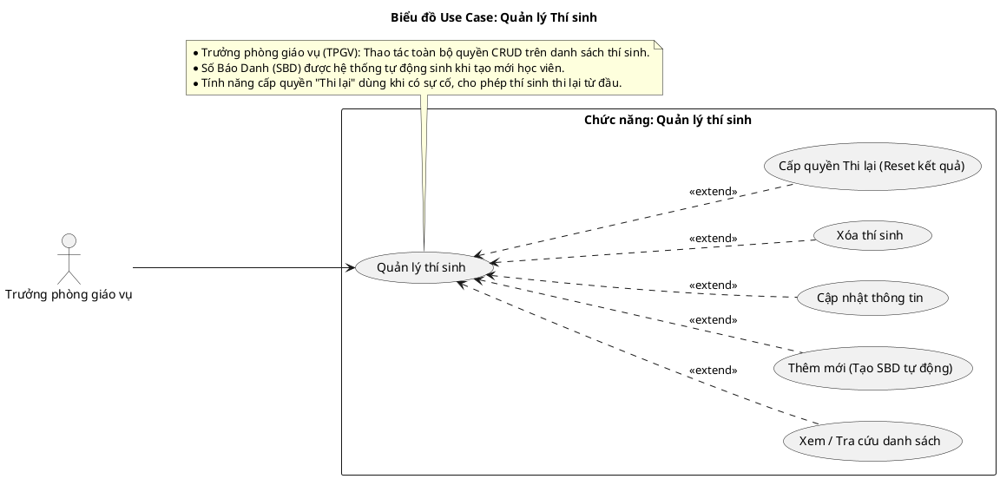
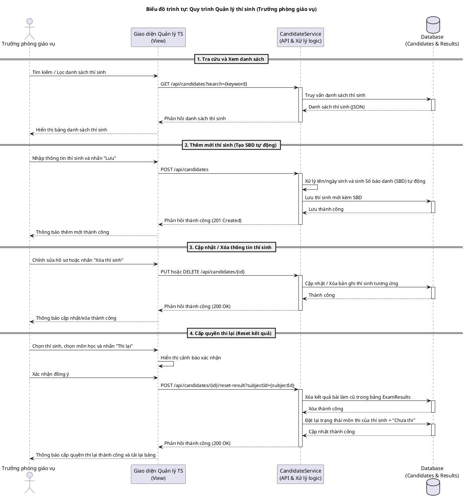
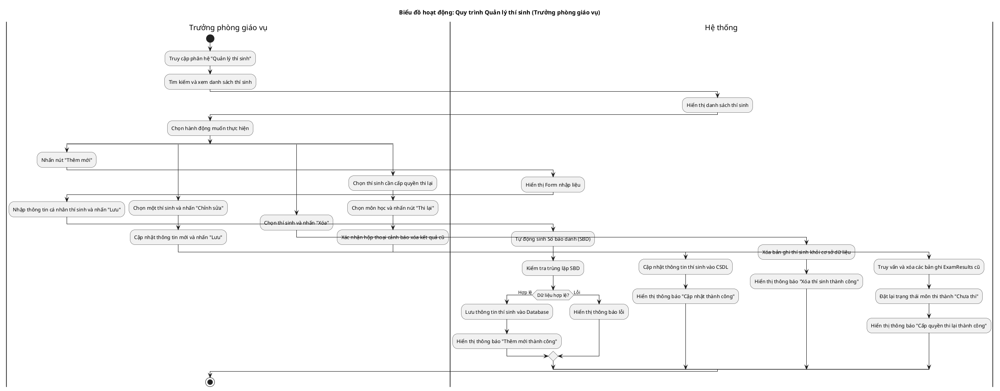

# Tài liệu Đặc tả: Quản lý Thí Sinh (Candidate Management)

## 1. Bảng Use Case chức năng

*Bảng 2.5. Bảng usecase chức năng quản lý thí sinh*

| Tên Use case       | Tác nhân                    | Giao dịch                                                                                                               | Độ phức tạp |
| :------------------ | :---------------------------- | :----------------------------------------------------------------------------------------------------------------------- | :-------------- |
| **Quản lý thí sinh**| **Trưởng phòng giáo vụ (TPGV)**|                                                                                                                          | Trung bình     |
|                     |                              | Trưởng phòng giáo vụ có thể thêm mới thí sinh. Hệ thống tạo số báo danh tự động và lưu thông tin thí sinh.               |                 |
|                     |                              | Trưởng phòng giáo vụ có thể cập nhật thông tin hồ sơ thí sinh. Hệ thống lưu thay đổi thông tin.                          |                 |
|                     |                              | Trưởng phòng giáo vụ có thể xóa hồ sơ thí sinh. Hệ thống xóa thông tin thí sinh khỏi cơ sở dữ liệu.                       |                 |
|                     |                              | Trưởng phòng giáo vụ có thể tìm kiếm, tra cứu danh sách thí sinh. Hệ thống hiển thị kết quả tìm kiếm.                     |                 |
|                     |                              | Trưởng phòng giáo vụ có thể cấp quyền "Thi lại" cho thí sinh. Hệ thống xóa kết quả thi cũ và mở khóa môn thi.            |                 |

---

## 2. Biểu đồ Use Case (Use Case Diagram)

**Mô tả:** Biểu đồ mô tả sự tương tác giữa Trưởng phòng giáo vụ (TPGV) và hệ thống trong phân hệ quản lý thông tin thí sinh. Bao gồm các chức năng cốt lõi: xem danh sách, thêm mới (kèm tạo tự động số báo danh), cập nhật thông tin, xóa thí sinh và đặc biệt là tính năng cấp quyền thi lại.

**Mục tiêu:** Cung cấp cái nhìn tổng quan về quyền hạn của tác nhân Trưởng phòng giáo vụ đối với hồ sơ thí sinh, đảm bảo mọi thao tác từ khi tạo mới đến khi xử lý sự cố thi cử đều được minh họa rõ ràng và đầy đủ.

---

## 3. Biểu đồ Trình tự chức năng (Sequence Diagram)

**Mô tả:** Biểu đồ trình tự mô tả quy trình tương tác của Trưởng phòng giáo vụ, từ việc tìm kiếm xem danh sách, thêm mới, cập nhật/xóa cho đến xử lý sự cố thi cử bằng tính năng cấp quyền "Thi lại" (xóa kết quả thi cũ và cập nhật lại trạng thái).

---

## 4. Biểu đồ Hoạt động (Activity Diagram)

**Mô tả:** Biểu đồ hoạt động mô tả tiến trình lựa chọn của Trưởng phòng giáo vụ đối với việc quản trị hồ sơ học viên, bao gồm các quy trình nghiệp vụ: Thêm mới (sinh SBD tự động), Chỉnh sửa thông tin, Xóa tài khoản, và Cấp quyền thi lại.

