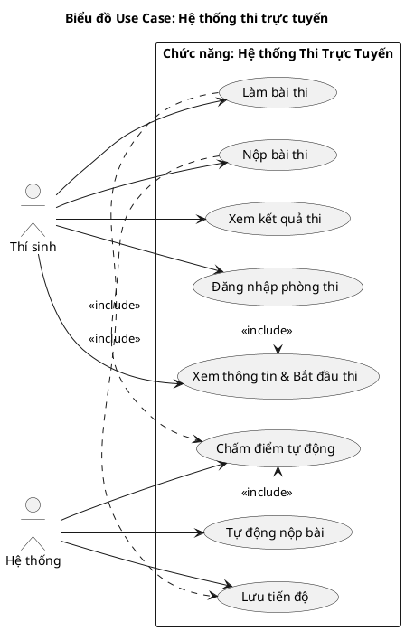
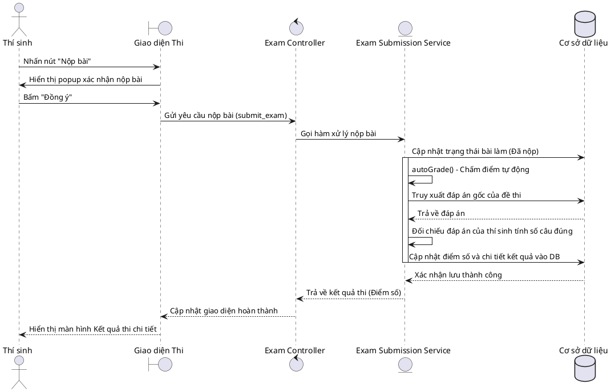
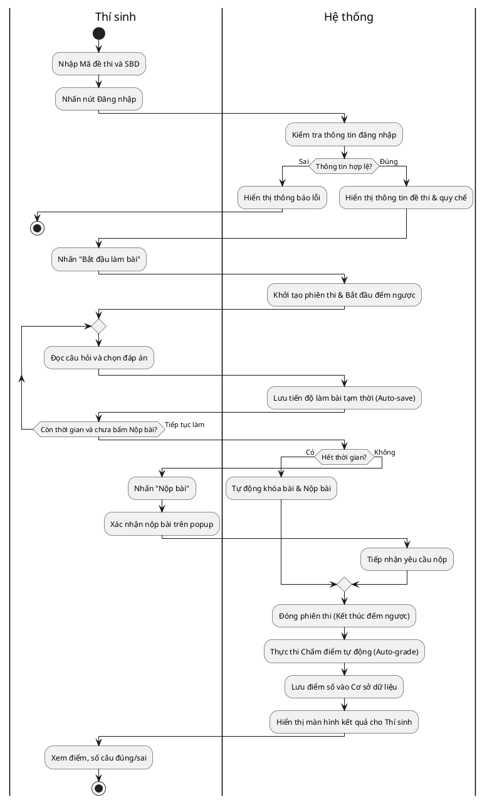
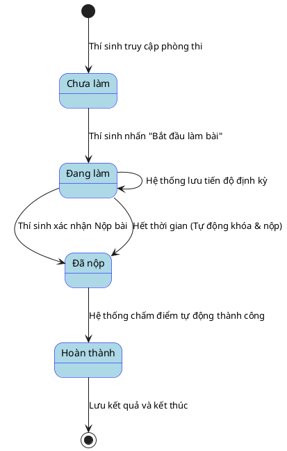

# Phân tích thiết kế phân hệ Thi Trực Tuyến

## 1. Tác nhân (Actors)

Trong phân hệ Thi Trực Tuyến, có 2 tác nhân chính tham gia:

- **Thí sinh (Candidate)**: Người trực tiếp tham gia làm bài thi trên hệ thống, thực hiện các thao tác đăng nhập, chọn đáp án và nộp bài.
- **Hệ thống (System)**: Tác nhân tự động thực hiện các tác vụ ngầm như đếm ngược thời gian, lưu tiến độ, tự động nộp bài khi hết giờ và tự động chấm điểm.

## 2. Bảng mô tả Use Case chức năng

Bảng dưới đây liệt kê các chức năng chính của phân hệ Thi Trực Tuyến:

| Tên Use case              | Tác nhân            | Giao dịch                                                                                                                          | Độ phức tạp |
| -------------------------- | --------------------- | ----------------------------------------------------------------------------------------------------------------------------------- | --------------- |
| **Thi trực tuyến** | Thí sinh, Hệ thống |                                                                                                                                     | Cao             |
|                            |                       | Thí sinh có thể đăng nhập vào phòng thi thông qua Mã đề thi và Số báo danh (SBD). Hệ thống kiểm tra thông tin    |                 |
|                            |                       | Thí sinh có thể xem các thông tin tổng quan trước khi bắt đầu. Hệ thống hiển thị thời gian, số câu hỏi, quy chế |                 |
|                            |                       | Thí sinh có thể tương tác với đề thi (chọn đáp án, chuyển câu hỏi). Hệ thống ghi nhận thao tác                  |                 |
|                            |                       | Hệ thống tự động lưu tiến độ (đáp án thí sinh đã chọn) trong suốt quá trình làm bài                            |                 |
|                            |                       | Thí sinh có thể chủ động nộp bài khi hoàn thành. Hệ thống xác nhận và thu bài                                       |                 |
|                            |                       | Hệ thống tự động thu bài và khóa quyền chỉnh sửa khi đồng hồ đếm ngược kết thúc                                 |                 |
|                            |                       | Hệ thống tự động chấm điểm bài thi bằng cách so khớp đáp án của thí sinh với đáp án gốc                       |                 |
|                            |                       | Thí sinh có thể xem điểm số tổng, số câu đúng/sai. Hệ thống hiển thị kết quả sau khi chấm xong                    |                 |

---

## 3. Biểu đồ Use Case (Use Case Diagram)

**Mô tả:** Biểu đồ thể hiện sự tương tác tổng thể giữa Thí sinh và Hệ thống đối với các chức năng trong phân hệ thi trực tuyến. Các chức năng chính bao gồm việc đăng nhập phòng thi, làm bài, nộp bài, và việc hệ thống tự động xử lý ngầm (lưu tiến độ, tự động khóa nộp bài và tự động chấm điểm).

**Mục tiêu:** Cung cấp cái nhìn bao quát về vai trò của từng tác nhân, quyền hạn và các hành động mà tác nhân có thể thực hiện, qua đó định hình rõ phạm vi chức năng của toàn bộ quy trình làm bài thi.

---

## 4. Biểu đồ Trình tự (Sequence Diagram)

Dưới đây là biểu đồ trình tự mô tả luồng nghiệp vụ quan trọng nhất: **Nộp bài và Chấm điểm tự động**.

**Mô tả:** Biểu đồ mô phỏng dòng thời gian và tuần tự lời gọi hàm khi Thí sinh thực hiện thao tác nộp bài. Lớp Giao diện gửi yêu cầu xuống Controller và Service để lưu trạng thái hoàn thành. Ngay sau đó, tiến trình chấm điểm tự động (`autoGrade()`) được kích hoạt: đối chiếu đáp án với cơ sở dữ liệu, tính điểm và lưu kết quả trước khi phản hồi điểm số trực tiếp lên màn hình cho Thí sinh.

**Mục tiêu:** Làm rõ thứ tự giao tiếp giữa các thành phần phần mềm (UI, Controller, Service, Database), đảm bảo khâu tiếp nhận bài thi và xử lý điểm tự động hoạt động chính xác, đồng bộ, và minh bạch.

---

## 5. Biểu đồ Hoạt động (Activity Diagram)

Biểu đồ mô tả toàn bộ quy trình từ lúc thí sinh đăng nhập đến khi nhận được kết quả.

---

## 6. Biểu đồ Trạng thái (State Diagram)

Biểu đồ mô tả vòng đời (các trạng thái) của một bài thi trực tuyến từ lúc thí sinh bắt đầu đến khi có kết quả.

