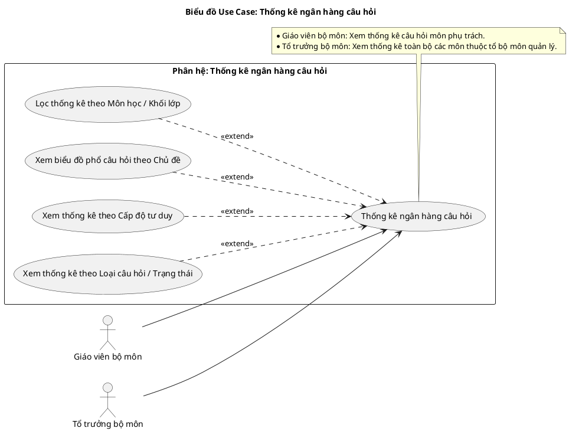
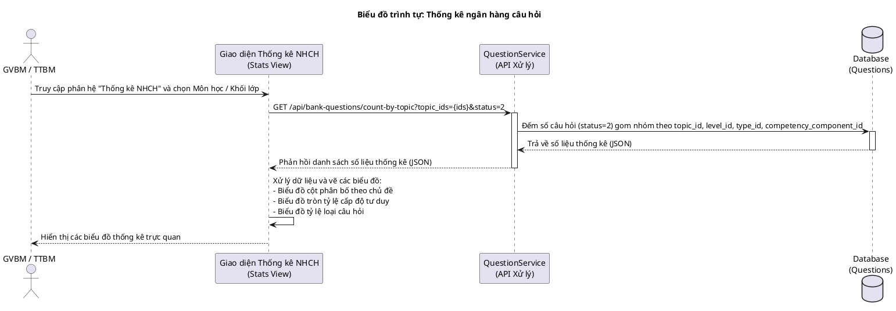
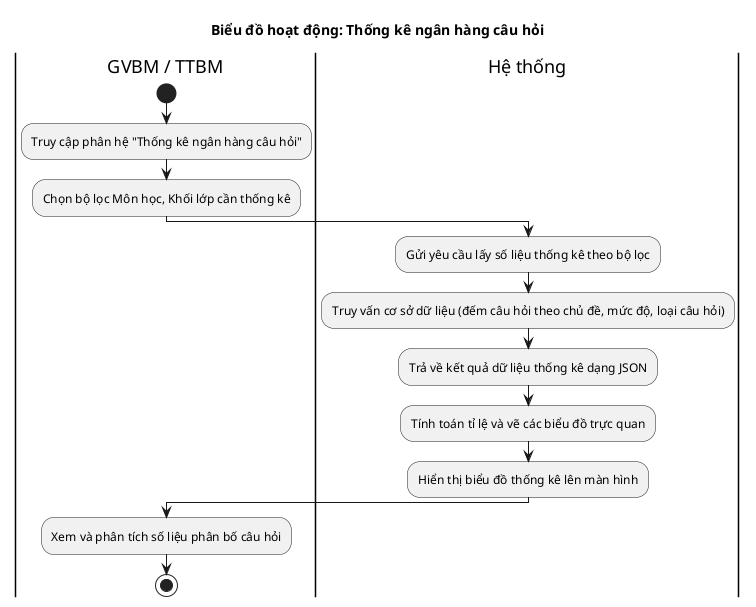

# Tài liệu Đặc tả: Thống kê Ngân hàng Câu hỏi (Question Bank Analytics)

## 1. Bảng Use Case chức năng

*Bảng 2.13. Bảng usecase chức năng thống kê ngân hàng câu hỏi*

| Tên Use case           | Tác nhân                    | Giao dịch                                                                                                              | Độ phức tạp |
| :---------------------- | :---------------------------- | :---------------------------------------------------------------------------------------------------------------------- | :-------------- |
| **Thống kê ngân hàng câu hỏi** | **Giáo viên bộ môn (GVBM)**   |                                                                                                                         | Trung bình      |
|                         |                               | Giáo viên bộ môn chọn bộ lọc Môn học/Khối lớp được phân công giảng dạy. Hệ thống tải dữ liệu thống kê.                  |                 |
|                         |                               | Hệ thống tính toán và hiển thị số lượng câu hỏi phân bổ theo từng Chủ đề, Cấp độ tư duy và Loại câu hỏi dưới dạng biểu đồ. |                 |
|                         | **Tổ trưởng bộ môn (TTBM)**   |                                                                                                                         | Trung bình      |
|                         |                               | Tổ trưởng bộ môn chọn bộ lọc các Môn học thuộc phạm vi tổ chuyên môn quản lý. Hệ thống tải dữ liệu thống kê.            |                 |
|                         |                               | Hệ thống tính toán và hiển thị số lượng câu hỏi phân bổ theo từng Chủ đề, Cấp độ tư duy và Loại câu hỏi dưới dạng biểu đồ. |                 |

---

## 2. Biểu đồ Use Case (Use Case Diagram)

**Mô tả:** Biểu đồ mô tả tương tác của Giáo viên bộ môn (GVBM) và Tổ trưởng bộ môn (TTBM) với chức năng thống kê ngân hàng câu hỏi. Người dùng có thể lọc thống kê theo môn học, xem biểu đồ phân bố câu hỏi theo chủ đề, cấp độ tư duy và loại câu hỏi.

**Mục tiêu:** Cung cấp cái nhìn tổng quan về cơ cấu phân bổ câu hỏi trong ngân hàng câu hỏi, hỗ trợ cán bộ chuyên môn đánh giá độ phủ và chất lượng của câu hỏi trước khi sinh đề.

---

## 3. Biểu đồ Trình tự chức năng (Sequence Diagram)

**Mô tả:** Biểu đồ trình tự thể hiện sự tương tác từ giao diện người dùng đến API nghiệp vụ của dự án (`GET /api/bank-questions/count-by-topic`). Hệ thống sẽ đếm số lượng câu hỏi trong CSDL đã duyệt (status = 2) theo từng nhóm: chủ đề, cấp độ nhận thức, loại câu hỏi và thành phần năng lực để trả về vẽ biểu đồ.

---

## 4. Biểu đồ Hoạt động (Activity Diagram)

**Mô tả:** Biểu đồ hoạt động mô tả tiến trình người dùng chọn môn học/khối lớp cần thống kê, hệ thống tiếp nhận, truy vấn dữ liệu đếm số câu hỏi và kết xuất biểu đồ hiển thị lên màn hình.

