# TÀI LIỆU MÔ TẢ TỔNG QUAN & CHI TIẾT USE CASE HỆ THỐNG

Dưới đây là tài liệu bao gồm Usecase Tổng quát toàn hệ thống và chi tiết các luồng nghiệp vụ.

---

## 1. MÔ TẢ TỔNG QUÁT USE CASE TOÀN HỆ THỐNG

### 1.1. Bảng phân rã các Phân hệ và Usecase cốt lõi

| Phân hệ (Modules)                                       | Tác nhân (Actors)    | Danh sách Usecase                                                                                                                    |
| :-------------------------------------------------------- | :--------------------- | :------------------------------------------------------------------------------------------------------------------------------------ |
| **Hệ thống Non-AI (Nghiệp vụ cốt lõi)**       |                        |                                                                                                                                       |
| **1. Quản trị & Phân quyền**                    | Admin                  | Đăng nhập, Quản lý tài khoản, Quản lý nhóm quyền, Quản lý Audit log.                                                     |
| **2. Danh mục Hệ thống**                         | Admin, TPGV            | Quản lý Môn học, Quản lý Khối lớp, Quản lý Độ khó, Quản lý Dạng câu hỏi, Quản lý Chuẩn năng lực.               |
| **3. Ngân hàng Câu hỏi**                        | GVBM, TTBM             | Tạo chủ đề, Biên soạn câu hỏi (Thêm/Sửa/Xóa), Phê duyệt câu hỏi, Quản lý lịch sử câu hỏi.                        |
| **4. Tạo Đề & Ma trận**                         | GVBM, TTBM, TPGV       | Cấu hình ma trận đề, Sinh đề gốc, Đóng gói đề thi, Thẩm định gói đề, Hoán vị mã đề, Xuất bản file Word/PDF. |
| **5. Thi Trực tuyến**                             | Admin, TPGV, Thí sinh | Tổ chức ca thi, Gán danh sách thí sinh & mã đề, Làm bài thi (Auto-sync), Nộp bài/Thu bài tự động.                     |
| **6. Kết quả & Thống kê**                       | GVBM, TPGV, Thí sinh  | Chấm điểm tự động, Xem điểm & chi tiết bài làm, Xuất bảng điểm Excel, Phân tích phổ điểm.                         |
| **Hệ thống AI (Tích hợp Trí tuệ nhân tạo)** |                        |                                                                                                                                       |
| **7. Sinh câu hỏi (AI Generation)**               | GVBM                   | Sinh câu hỏi từ Prompt, Sinh câu hỏi từ tài liệu (PDF/Word), Sinh câu hỏi từ Ma trận.                                     |
| **8. Biên tập & Thẩm định (AI Refinement)**    | GVBM, TTBM             | Sửa lỗi chính tả/ngữ pháp, Tự động sinh phương án nhiễu, Gợi ý độ khó câu hỏi.                                    |
| **9. Tối ưu Đề thi (AI Optimization)**          | GVBM, TTBM             | Cảnh báo trùng lặp ngữ nghĩa câu hỏi, Gợi ý câu hỏi thay thế tương đương.                                           |

### 1.2. Biểu đồ Usecase Tổng Quát Toàn Hệ Thống (PlantUML)

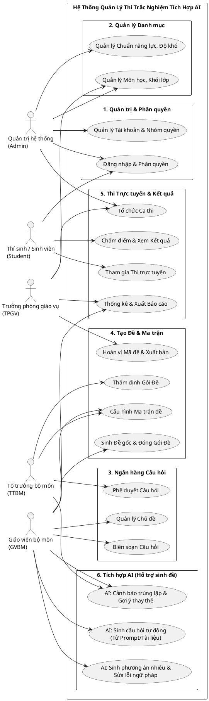

---

### 1.3. Sơ đồ & Mô tả Kiến trúc Hệ thống Tổng thể (System Architecture Diagram)

Biểu đồ dưới đây mô hình hóa kiến trúc phân tầng (Layered Architecture) chuẩn của hệ thống **Quản lý Sinh đề & Tổ chức Thi trắc nghiệm tích hợp AI**, bao gồm sự phối hợp giữa Frontend (React/Vite), Proxy (Nginx), Backend API Services (Python/FastAPI), Hệ quản trị CSDL (MySQL, Redis, File Storage) và Dịch vụ Trí tuệ nhân tạo (Google Gemini API).

#### Biểu đồ Kiến trúc Hệ thống (PlantUML Architecture Diagram)

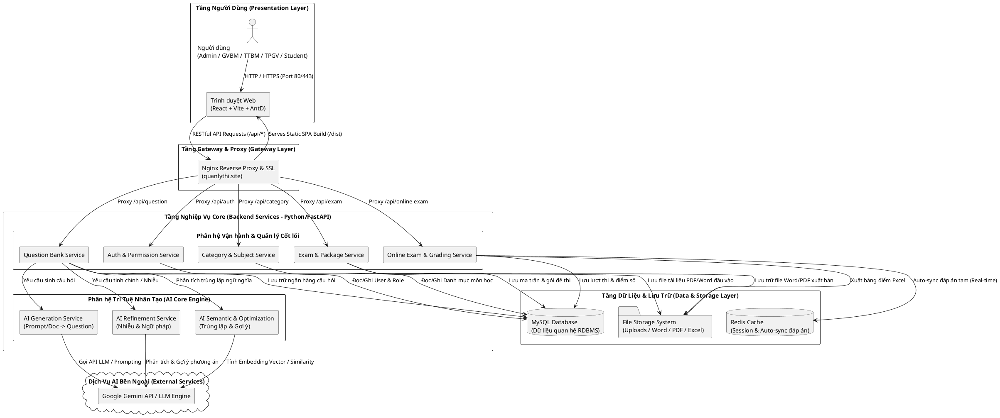

#### Mô tả chi tiết các Tầng Kiến trúc (Architectural Layers)

1. **Tầng Người dùng (Presentation Layer - Frontend):**

   - Đóng vai trò làm giao diện tương tác người dùng (SPA - Single Page Application), phát triển trên nền **ReactJS**, **Vite** và **Ant Design**.
   - Hỗ trợ đầy đủ giao diện cho 5 nhóm tác nhân: Quản trị viên (Admin), Trưởng phòng giáo vụ (TPGV), Tổ trưởng bộ môn (TTBM), Giáo viên bộ môn (GVBM) và Thí sinh (Student).
   - Tích hợp công cụ Render công thức toán học/hóa học (LaTeX/MathJax) và xử lý biểu đồ thống kê phổ điểm linh hoạt.
2. **Tầng Cổng vào & Proxy (Gateway & Proxy Layer):**

   - Đóng vai trò là điểm tiếp nhận trung tâm sử dụng **Nginx Reverse Proxy**.
   - Phân luồng dữ liệu: Phục vụ các file tĩnh của Single Page Application (React) cho client tại đường dẫn gốc `/` và điều hướng toàn bộ request API sang backend Python qua tiền tố `/api/`.
   - Quản lý và gia cố bảo mật bằng chứng chỉ **SSL Let's Encrypt (HTTPS)** trên tên miền `quanlythi.site`.
3. **Tầng Nghiệp vụ Core (Application & Backend Services Layer):**

   - Đã được mô hình hóa và triển khai dạng các Microservices/Modules chạy độc lập với **Python FastAPI / Uvicorn**.
   - **Auth & Permission Service:** Quản lý xác thực JWT, phân quyền theo vai trò (RBAC) và lưu vết Audit Log.
   - **Question Bank & Exam Service:** Quản lý ngân hàng câu hỏi đa dạng, cấu hình ma trận đề, đóng gói đề thi, hoán vị mã đề tự động và xuất bản file Word/PDF.
   - **Online Exam & Grading Service:** Tổ chức ca thi, cấp mã phòng thi, tự động đồng bộ nháp bài làm (Auto-sync), chấm điểm tự động tức thì và xuất kết quả ra file Excel.
   - **AI Core Engine Service:** Tích hợp với **Google Gemini API** để thực hiện 3 tác vụ AI chuyên sâu: Sinh câu hỏi (Prompt/File), Tinh chỉnh câu hỏi (Nhiễu/Ngữ pháp) và Phân tích tối ưu đề thi (Phát hiện trùng lặp ngữ nghĩa).
4. **Tầng Dữ liệu & Lưu trữ (Data & Persistence Layer):**

   - **MySQL Database (RDBMS):** Đóng vai trò lưu trữ cơ sở dữ liệu vật lý toàn hệ thống (User, Môn học, Ma trận, Đề thi, Lượt thi, Audit Logs...).
   - **Redis Cache:** Lưu trữ bộ nhớ tạm phục vụ lưu nháp bài thi theo thời gian thực (Auto-sync) giúp chống mất dữ liệu khi gián đoạn kết nối mạng và quản lý session làm bài.
   - **File Storage System:** Lưu trữ tệp tin tài liệu đầu vào (PDF/Word), các gói đề thi xuất bản (Word/PDF) và file báo cáo bảng điểm Excel xuất ra cho giảng viên/giáo vụ.

---

## 2. CHI TIẾT USE CASE TỪNG PHÂN HỆ

### 2.1. Usecase Quản lý gói đề

### Bảng 2.13. Bảng usecase chức năng quản lý gói đề

| Tên Use case                 | Tác nhân     | Giao dịch                                                                                                       | Độ phức tạp |
| :---------------------------- | :------------- | :--------------------------------------------------------------------------------------------------------------- | :-------------- |
| **Quản lý gói đề** | **GVBM** |                                                                                                                  | Phức tạp      |
|                               |                | Giáo viên bộ môn có thể thêm mới gói đề từ các đề gốc. Hệ thống thêm mới gói đề.          |                 |
|                               |                | Giáo viên bộ môn có thể cập nhật thông tin gói đề. Hệ thống sửa thông tin gói đề.             |                 |
|                               |                | Giáo viên bộ môn có thể xem danh sách gói đề. Hệ thống hiển thị danh sách gói đề.              |                 |
|                               |                | Giáo viên bộ môn có thể xóa gói đề. Hệ thống xóa gói đề.                                         |                 |
|                               |                | Giáo viên bộ môn gửi thẩm định gói đề. Hệ thống cập nhật trạng thái chờ duyệt.                |                 |
|                               | **TTBM** |                                                                                                                  | Phức tạp      |
|                               |                | Tổ trưởng bộ môn xem danh sách các gói đề cần thẩm định. Hệ thống hiển thị danh sách.         |                 |
|                               |                | Tổ trưởng bộ môn thực hiện thẩm định/Phê duyệt gói đề. Hệ thống cập nhật trạng thái duyệt. |                 |
|                               |                | Tổ trưởng bộ môn thực hiện từ chối thẩm định. Hệ thống cập nhật trạng thái từ chối.          |                 |
|                               | **TPGV** |                                                                                                                  | Cơ bản        |
|                               |                | Trưởng phòng giáo vụ xem danh sách các gói đề đã thẩm định. Hệ thống hiển thị danh sách.     |                 |
|                               |                | Trưởng phòng giáo vụ chọn gói đề cần xuất. Hệ thống hiển thị chi tiết gói đề.                 |                 |
|                               |                | Trưởng phòng giáo vụ xuất file Word. Hệ thống tạo và xuất file Word cho phép tải về.               |                 |

### Biểu đồ Use Case: Quản lý gói đề

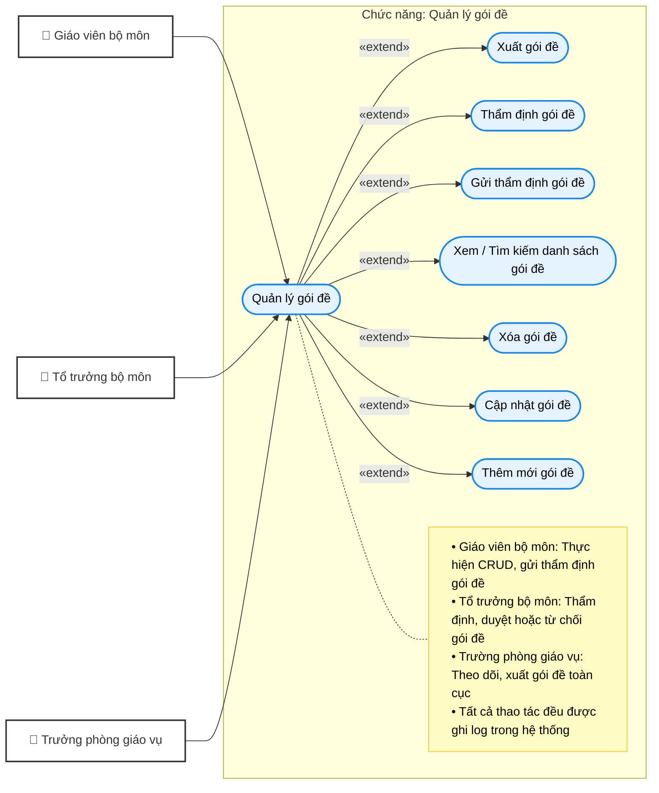

### Biểu đồ Trình tự: Thêm mới gói đề

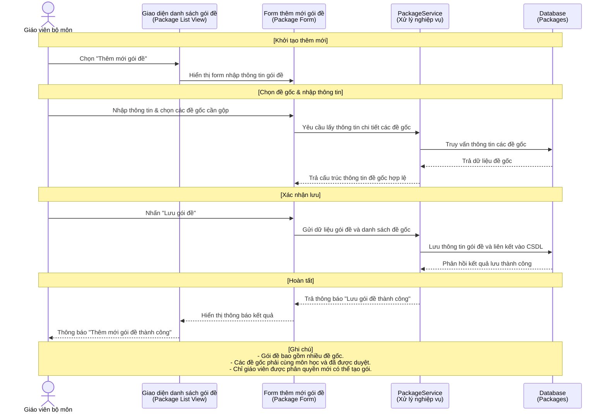

### Biểu đồ Hoạt động: Thêm mới gói đề

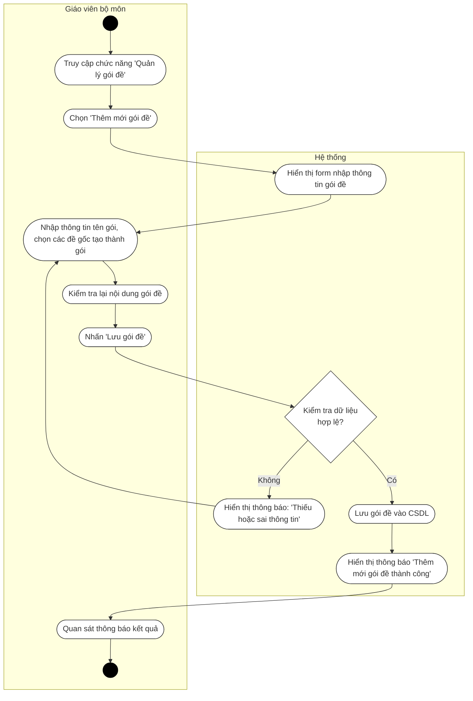

---

## 2.3.14. Usecase Quản lý thí sinh

### Bảng 2.14. Bảng usecase chức năng quản lý thí sinh

| Tên Use case                 | Tác nhân             | Giao dịch                                                                                                         | Độ phức tạp |
| :---------------------------- | :--------------------- | :----------------------------------------------------------------------------------------------------------------- | :-------------- |
| **Quản lý thí sinh** | **TPGV / Admin** |                                                                                                                    | Phức tạp      |
|                               |                        | Cán bộ phụ trách có thể thêm mới thí sinh thủ công. Hệ thống hiển thị form và lưu thí sinh mới. |                 |
|                               |                        | Cán bộ phụ trách có thể sửa thông tin thí sinh. Hệ thống cập nhật thông tin vào CSDL.               |                 |
|                               |                        | Cán bộ phụ trách có thể xem danh sách thí sinh. Hệ thống hiển thị bảng danh sách.                    |                 |
|                               |                        | Cán bộ phụ trách có thể xóa thí sinh. Hệ thống xóa thông tin thí sinh.                                |                 |
|                               |                        | Cán bộ phụ trách có thể tìm kiếm thí sinh. Hệ thống lọc và trả về kết quả tương ứng.           |                 |

### Biểu đồ Use Case: Quản lý thí sinh

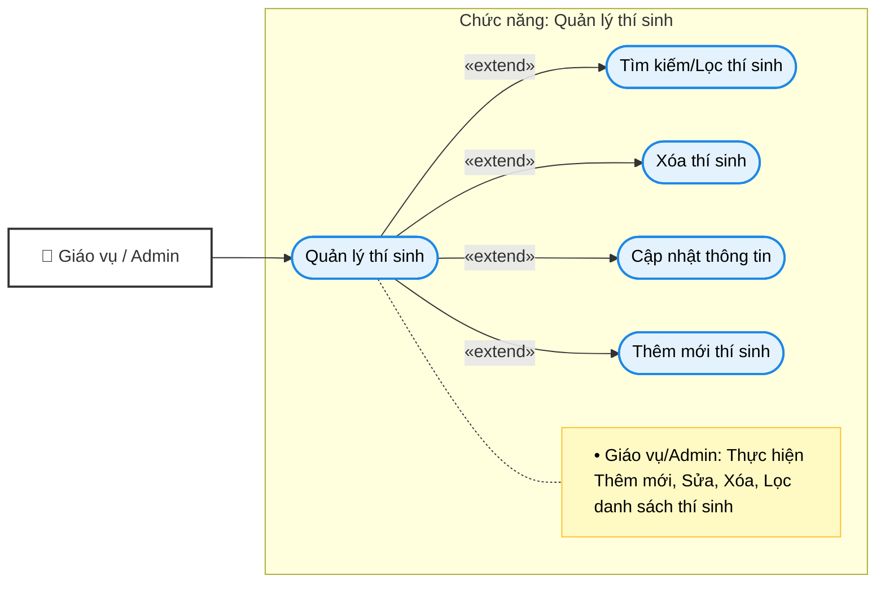

### Biểu đồ Trình tự: Thêm mới thí sinh thủ công

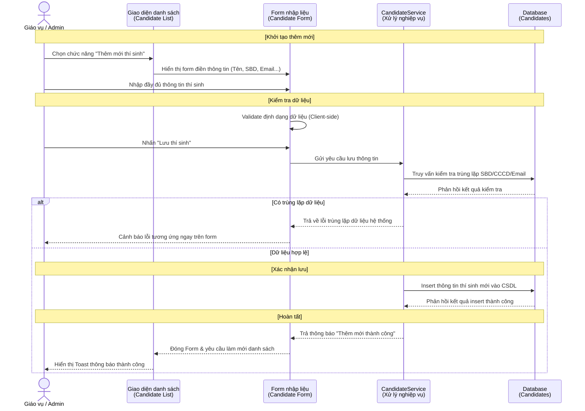

### Biểu đồ Hoạt động: Thêm mới thí sinh thủ công

---

## 2.3.15 Usecase Quản lý kết quả thi

### Bảng 2.15. Bảng usecase chức năng quản lý kết quả thi

| Tên Use case                     | Tác nhân            | Giao dịch                                                                                                    | Độ phức tạp |
| :-------------------------------- | :-------------------- | :------------------------------------------------------------------------------------------------------------ | :-------------- |
| **Quản lý kết quả thi** | **GVBM / TPGV** |                                                                                                               | Cơ bản        |
|                                   |                       | Cán bộ phụ trách có thể xem danh sách kết quả kỳ thi. Hệ thống hiển thị bảng điểm.           |                 |
|                                   |                       | Cán bộ phụ trách có thể xem chi tiết bài làm của thí sinh. Hệ thống mở form chi tiết bài thi. |                 |
|                                   |                       | Cán bộ phụ trách có thể xem biểu đồ thống kê kết quả. Hệ thống render biểu đồ phổ điểm.  |                 |
|                                   |                       | Cán bộ phụ trách có thể xuất bảng điểm ra Excel. Hệ thống tạo và tải file báo cáo Excel.     |                 |

### Biểu đồ Use Case: Quản lý kết quả thi

### Biểu đồ Trình tự: Xem chi tiết bài làm

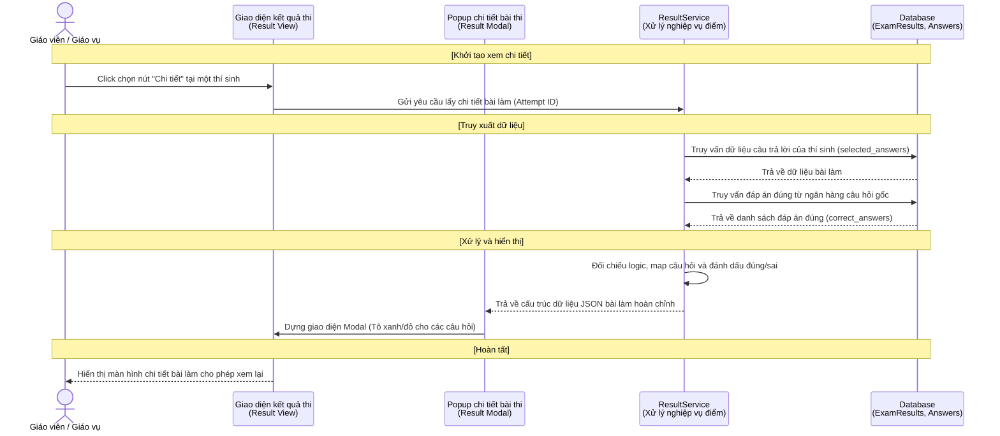

### Biểu đồ Hoạt động: Xem chi tiết bài làm

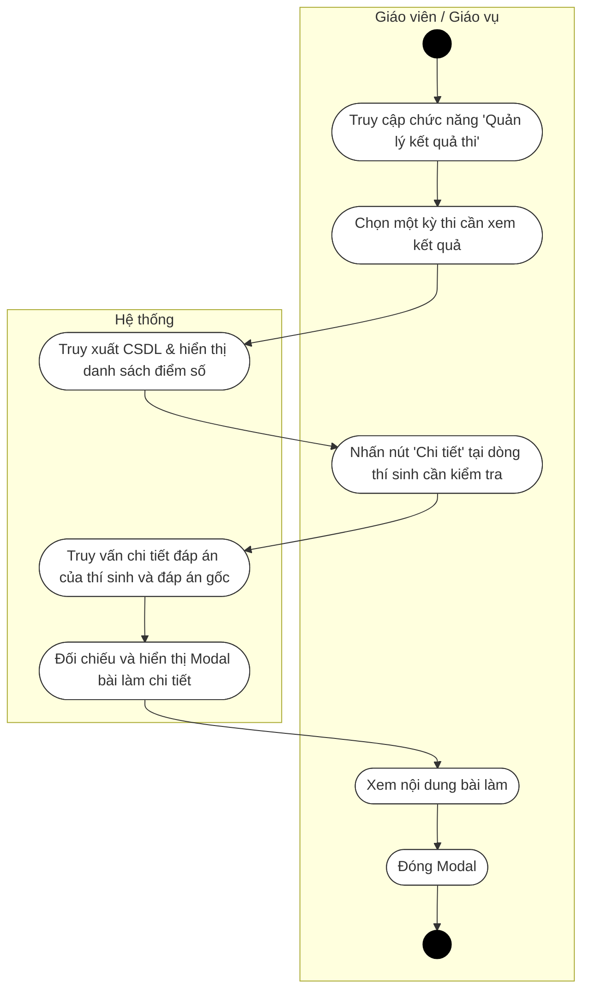

---

## 2.3.16 Usecase Thi trực tuyến

### Bảng 2.16. Bảng usecase chức năng thi trực tuyến

| Tên Use case              | Tác nhân   | Giao dịch                                                                                            | Độ phức tạp |
| :------------------------- | :----------- | :---------------------------------------------------------------------------------------------------- | :-------------- |
| **Thi trực tuyến** | **TS** |                                                                                                       | Phức tạp      |
|                            |              | Thí sinh thực hiện đăng nhập vào cổng thi. Hệ thống xác thực mã truy cập.               |                 |
|                            |              | Thí sinh chọn "Bắt đầu làm bài". Hệ thống sinh đề, bắt đầu tính giờ làm bài.        |                 |
|                            |              | Thí sinh chọn đáp án. Hệ thống tự động lưu nháp dữ liệu lên máy chủ.                 |                 |
|                            |              | Thí sinh chọn "Nộp bài". Hệ thống đối chiếu kết quả, tính điểm và lưu lại.           |                 |
|                            |              | Thí sinh chọn "Xem kết quả". Hệ thống hiển thị điểm ngay sau khi nộp (nếu được phép). |                 |

### Biểu đồ Use Case: Thi trực tuyến

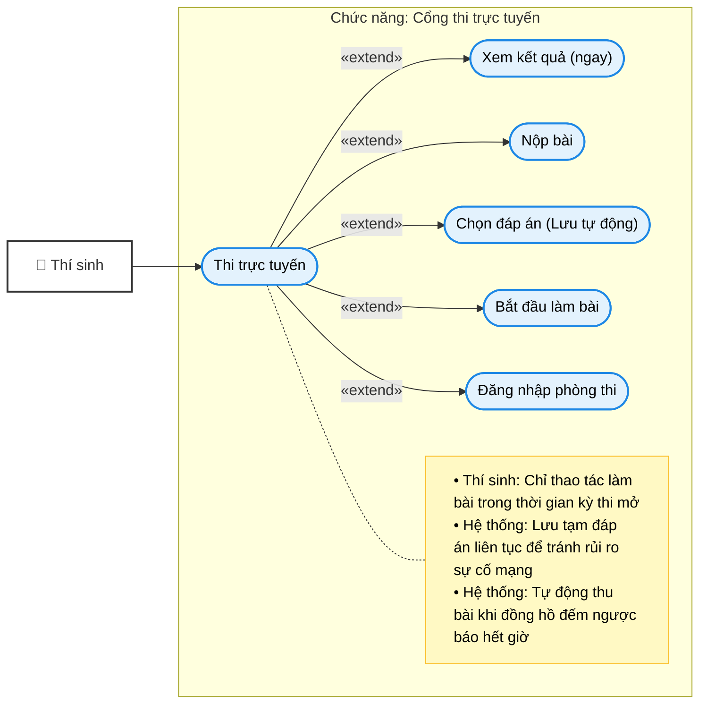

### Biểu đồ Trình tự: Quá trình Làm bài & Nộp bài

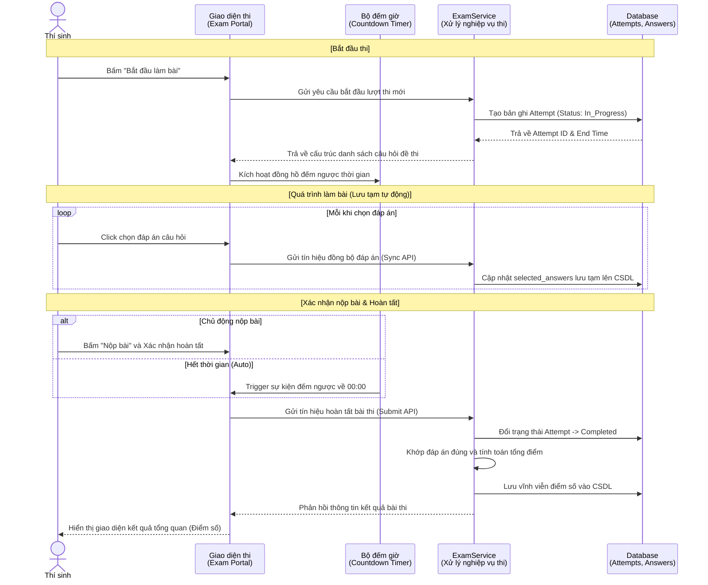

### Biểu đồ Hoạt động: Quá trình Làm bài & Nộp bài

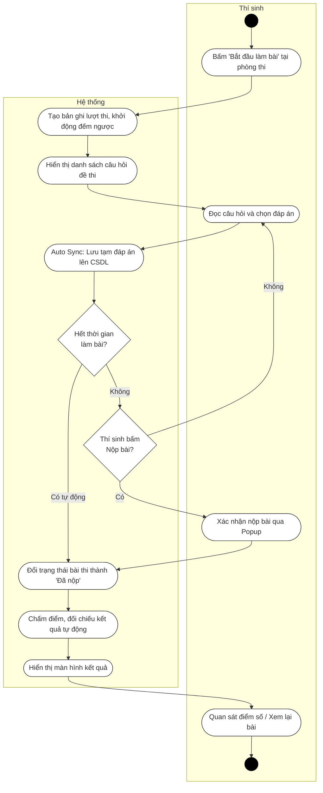
