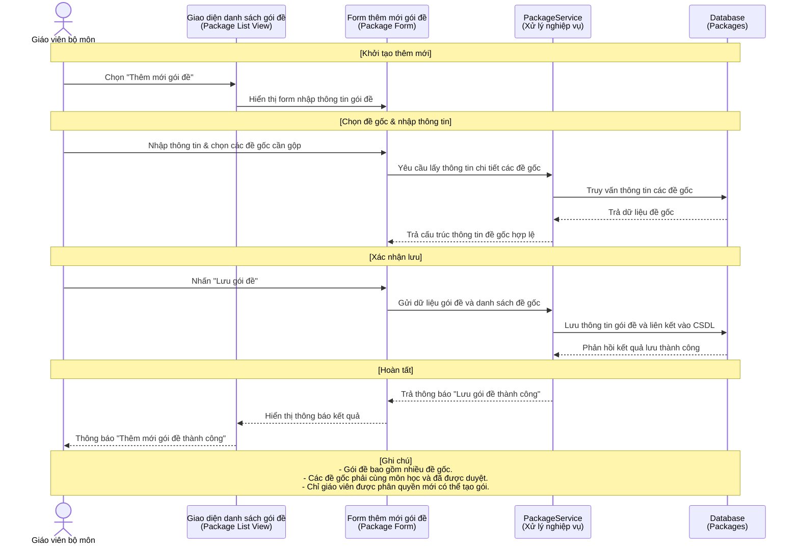
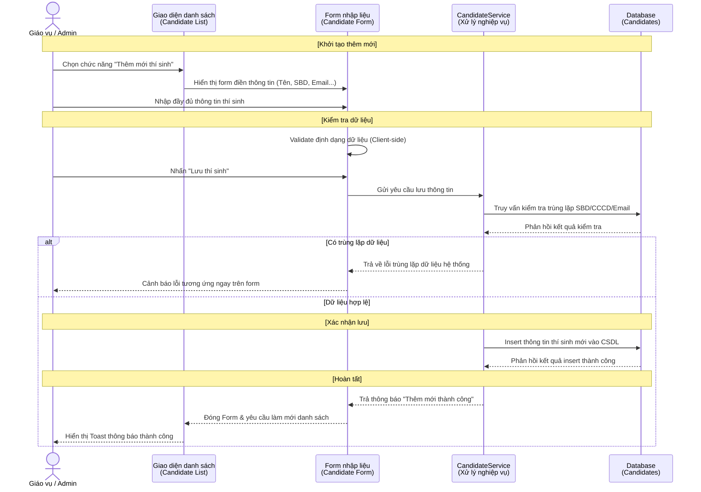
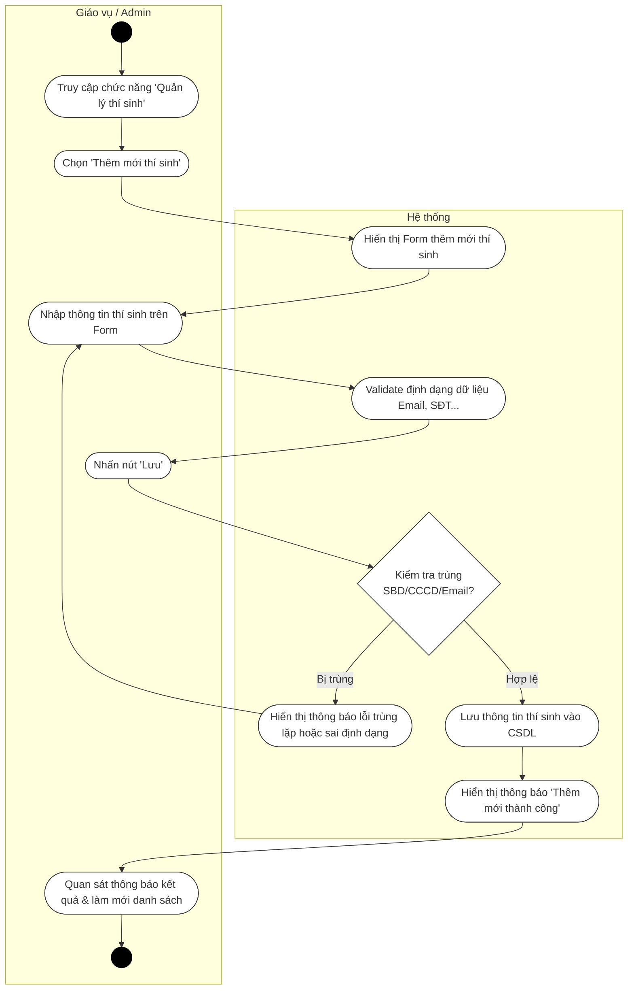
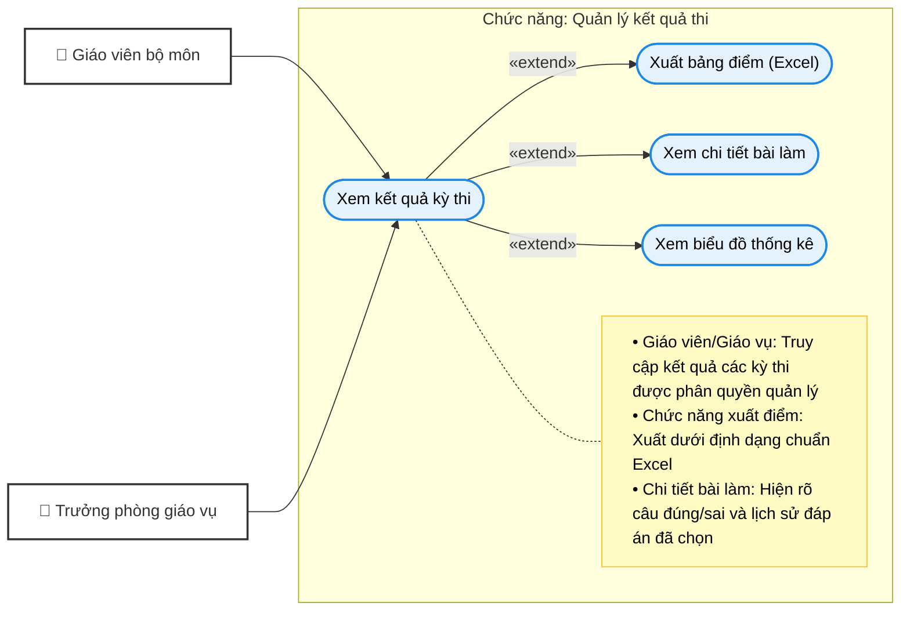
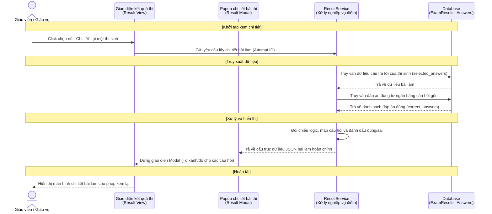
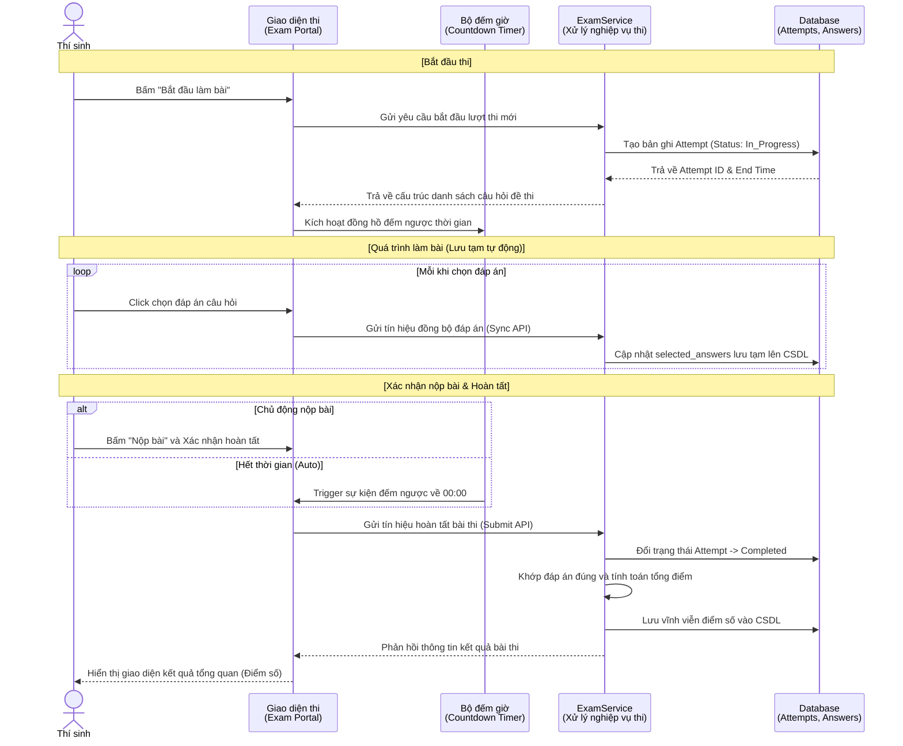

# TÀI LIỆU MÔ TẢ CHI TIẾT USE CASE (2.3.13 - 2.3.16)

Dưới đây là tài liệu đã được cập nhật lại theo yêu cầu:

1. **Loại bỏ hoàn toàn luồng Import Excel** trong Use Case Quản lý thí sinh (thay thế bằng thêm mới thủ công).
2. **Khắc phục lỗi hiển thị/render (cú pháp)** ở tất cả các biểu đồ Hoạt động (Activity Diagram) thông qua việc cấu trúc lại khối `subgraph` một cách chính xác nhất.

---

## 2.3.13. Usecase Quản lý gói đề

### Bảng 2.13. Bảng usecase chức năng quản lý gói đề

| Tên Use case                 | Tác nhân     | Giao dịch                                                                                                       | Độ phức tạp |
| :---------------------------- | :------------- | :--------------------------------------------------------------------------------------------------------------- | :-------------- |
| **Quản lý gói đề** | **GVBM** |                                                                                                                  | Phức tạp      |
|                               |                | Giáo viên bộ môn có thể thêm mới gói đề từ các đề gốc. Hệ thống thêm mới gói đề.          |                 |
|                               |                | Giáo viên bộ môn có thể cập nhật thông tin gói đề. Hệ thống sửa thông tin gói đề.             |                 |
|                               |                | Giáo viên bộ môn có thể xem danh sách gói đề. Hệ thống hiển thị danh sách gói đề.              |                 |
|                               |                | Giáo viên bộ môn có thể xóa gói đề. Hệ thống xóa gói đề.                                         |                 |
|                               |                | Giáo viên bộ môn gửi thẩm định gói đề. Hệ thống cập nhật trạng thái chờ duyệt.                |                 |
|                               | **TTBM** |                                                                                                                  | Phức tạp      |
|                               |                | Tổ trưởng bộ môn xem danh sách các gói đề cần thẩm định. Hệ thống hiển thị danh sách.         |                 |
|                               |                | Tổ trưởng bộ môn thực hiện thẩm định/Phê duyệt gói đề. Hệ thống cập nhật trạng thái duyệt. |                 |
|                               |                | Tổ trưởng bộ môn thực hiện từ chối thẩm định. Hệ thống cập nhật trạng thái từ chối.          |                 |
|                               | **TPGV** |                                                                                                                  | Cơ bản        |
|                               |                | Trưởng phòng giáo vụ xem danh sách các gói đề đã thẩm định. Hệ thống hiển thị danh sách.     |                 |
|                               |                | Trưởng phòng giáo vụ chọn gói đề cần xuất. Hệ thống hiển thị chi tiết gói đề.                 |                 |
|                               |                | Trưởng phòng giáo vụ xuất file Word. Hệ thống tạo và xuất file Word cho phép tải về.               |                 |

### Biểu đồ Use Case: Quản lý gói đề

### Biểu đồ Trình tự: Thêm mới gói đề

### Biểu đồ Hoạt động: Thêm mới gói đề

---

## 2.3.14. Usecase Quản lý thí sinh

### Bảng 2.14. Bảng usecase chức năng quản lý thí sinh

| Tên Use case                 | Tác nhân             | Giao dịch                                                                                                         | Độ phức tạp |
| :---------------------------- | :--------------------- | :----------------------------------------------------------------------------------------------------------------- | :-------------- |
| **Quản lý thí sinh** | **TPGV / Admin** |                                                                                                                    | Phức tạp      |
|                               |                        | Cán bộ phụ trách có thể thêm mới thí sinh thủ công. Hệ thống hiển thị form và lưu thí sinh mới. |                 |
|                               |                        | Cán bộ phụ trách có thể sửa thông tin thí sinh. Hệ thống cập nhật thông tin vào CSDL.               |                 |
|                               |                        | Cán bộ phụ trách có thể xem danh sách thí sinh. Hệ thống hiển thị bảng danh sách.                    |                 |
|                               |                        | Cán bộ phụ trách có thể xóa thí sinh. Hệ thống xóa thông tin thí sinh.                                |                 |
|                               |                        | Cán bộ phụ trách có thể tìm kiếm thí sinh. Hệ thống lọc và trả về kết quả tương ứng.           |                 |

### Biểu đồ Use Case: Quản lý thí sinh

### Biểu đồ Trình tự: Thêm mới thí sinh thủ công

### Biểu đồ Hoạt động: Thêm mới thí sinh thủ công

---

## 2.3.15 Usecase Quản lý kết quả thi

### Bảng 2.15. Bảng usecase chức năng quản lý kết quả thi

| Tên Use case                     | Tác nhân            | Giao dịch                                                                                                    | Độ phức tạp |
| :-------------------------------- | :-------------------- | :------------------------------------------------------------------------------------------------------------ | :-------------- |
| **Quản lý kết quả thi** | **GVBM / TPGV** |                                                                                                               | Cơ bản        |
|                                   |                       | Cán bộ phụ trách có thể xem danh sách kết quả kỳ thi. Hệ thống hiển thị bảng điểm.           |                 |
|                                   |                       | Cán bộ phụ trách có thể xem chi tiết bài làm của thí sinh. Hệ thống mở form chi tiết bài thi. |                 |
|                                   |                       | Cán bộ phụ trách có thể xem biểu đồ thống kê kết quả. Hệ thống render biểu đồ phổ điểm.  |                 |
|                                   |                       | Cán bộ phụ trách có thể xuất bảng điểm ra Excel. Hệ thống tạo và tải file báo cáo Excel.     |                 |

### Biểu đồ Use Case: Quản lý kết quả thi

### Biểu đồ Trình tự: Xem chi tiết bài làm

### Biểu đồ Hoạt động: Xem chi tiết bài làm

---

## 2.3.16 Usecase Thi trực tuyến

### Bảng 2.16. Bảng usecase chức năng thi trực tuyến

| Tên Use case              | Tác nhân   | Giao dịch                                                                                            | Độ phức tạp |
| :------------------------- | :----------- | :---------------------------------------------------------------------------------------------------- | :-------------- |
| **Thi trực tuyến** | **TS** |                                                                                                       | Phức tạp      |
|                            |              | Thí sinh thực hiện đăng nhập vào cổng thi. Hệ thống xác thực mã truy cập.               |                 |
|                            |              | Thí sinh chọn "Bắt đầu làm bài". Hệ thống sinh đề, bắt đầu tính giờ làm bài.        |                 |
|                            |              | Thí sinh chọn đáp án. Hệ thống tự động lưu nháp dữ liệu lên máy chủ.                 |                 |
|                            |              | Thí sinh chọn "Nộp bài". Hệ thống đối chiếu kết quả, tính điểm và lưu lại.           |                 |
|                            |              | Thí sinh chọn "Xem kết quả". Hệ thống hiển thị điểm ngay sau khi nộp (nếu được phép). |                 |

### Biểu đồ Use Case: Thi trực tuyến

### Biểu đồ Trình tự: Quá trình Làm bài & Nộp bài

### Biểu đồ Hoạt động: Quá trình Làm bài & Nộp bài

